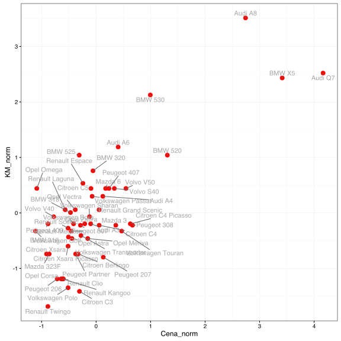
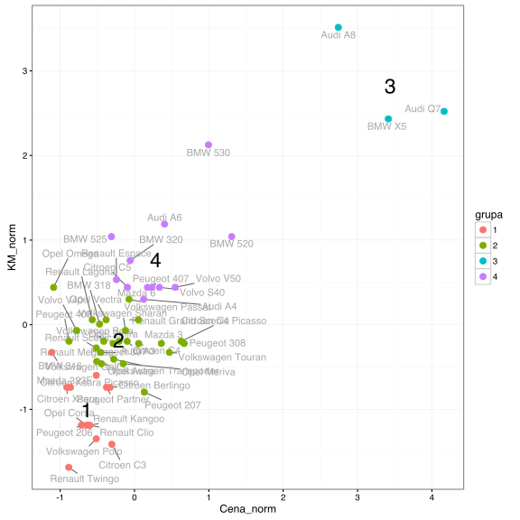
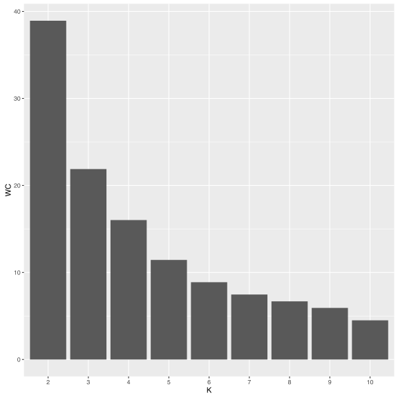

# Jak szukać partycji w oparciu o metodę k-średnich?

Algorytm k-średnich dzieli zbiór obserwacji na $$k$$ rozłącznych grup (czasami nazywanych skupiskami), takich że: *suma odległości obiektów wewnątrz tej samej grupy jest możliwie mała a pomiędzy grupami możliwie duża*.

Jest to dosyć mglisty cel, który można realizować na różne sposoby. Zobaczmy więc jak jest on realizowany w przypadku algorytmu k-średnich.

Przyjmijmy, że przypisujemy do $$K$$ grup indeksowanych liczbami $$1, ..., K$$. Niech funkcja $$C(x_i)$$ oznacza przypisanie obiektu $$x_i$$ do grupy. Dodatkowo wprowadźmy następujące oznaczenia: $$W(C)$$ to suma odległości obiektów wewnątrz tych samych grup (*within*), a $$B(C)$$ to suma odległości obiektów pomiędzy grupami (*between*).

$$
W(C) = \frac 12 \sum_{k=1}^K \sum_{i, C(i) = k} \sum_{j, C(j) = k} d(x_i, x_j),
$$

$$
B(C) = \frac 12 \sum_{k=1}^K \sum_{i, C(i) = k} \sum_{j, C(j) \neq k} d(x_i, x_j).
$$

Suma obu tych wartości jest stała i równa sumarycznej odległości pomiędzy wszystkimi obiektami. Skoro suma jest stała, to minimalizacja czy to $$W(C)/B(C)$$ czy $$W(C) - B(C)$$ jest równoważna minimalizacji samego $$W(C)$$. Jeżeli dodatkowo za odległość $$d(x_i,x_j)$$ wybierzemy kwadrat odległości Euklidesowej, to otrzymamy następujący wzór na sumę odległości w grupach 

$$
W(C) = \sum_{k=1}^K \#{j: C(j) = k} \sum_{i, C(i) = k} || x_i - \bar x_k ||^2.
$$

Więcej informacji o tym wzorze znaleźć można w rozdziale 14.3.5 *The Elements of Statistical Learning* Trevor Hastie, Robert Tibshirani, Jerome Friedman.

Jeżeli obserwacji jest niebanalna liczba, nie sposób sprawdzić wszystkich możliwych podziałów $$N$$ obiektów na $$K$$ grup, więc siłowo wartości $$W(C)$$ nie możemy zminimalizować. Zazwyczaj robi się to poprzez algorytm iteracyjnej poprawy wartości $$W(C)$$ przez poprawianie przypisywania do grup.

## Algorytm k-średnich

0. Wybierz losowe przypisanie do grup (lub losowe środki grup).

1. Dla określonego przypisania do grup wartość $$W(C)$$ jest minimalizowana, jeżeli środki grup opisane są przez średnie w grupach. Wyznacz środki poszczególnych grup jako średnie 
$$
\bar x_k = \frac{1}{\#{j: C(j) = k}} \sum_{i, C(i) = k} x_i.
$$

2. Dla określonych średnich wartość $$W(C)$$ jest minimalizowana, jeżeli każda obserwacja jest przypisana do grupy wyznaczonej przez najbliższą średnią
$$
C(i) = arg\min_k ||x_i - \bar x_k||^2,
$$

3. Powtarzaj kroki 1-2 tak długo póki zmienia się przypisanie do grup $$C(x_i)$$. 


Powyższy algorytm z kroku na krok minimalizuje funkcję $$W(C)$$, ale może utknąć w lokalnym minimum tej funkcji. Dlatego zaleca się wystartowanie go z kilku różnych losowych konfiguracji początkowych.


## Przykład

Analizę grup przeprowadzimy na wybranych 57 modelach aut, opierając się na zbiorze danych `auta2012` z pakietu `PogromcyDanych`. Policzyliśmy wcześniej na podstawie dwuletnich ofert, średnią cenę, przebieg, pojemność silnika, liczbę koni mechanicznych i frakcję aut z silnikiem diesla. 

Wyznaczmy podział na grupy bazując na dwóch cechach – cena i liczba koni mechanicznych. Ponieważ są to skośne zmienne na bardzo różnych skalach, więc najpierw obie zmienne unormujemy by odległość Euklidesowa miała jakikolwiek sens. W tym przypadku normalizacja polega na ustandaryzowaniu (odjęciu średniej, podzieleniu przez odchylenie standardowe) pierwiastka z każdej z tych cech. 


```r
auta <- archivist::aread("pbiecek/Przewodnik/arepo/bf2846de03bc8434d234b08fd2e31694")
auta$nazwa <- rownames(auta)
auta$Cena_norm <- scale(sqrt(auta$Cena))
auta$KM_norm <- scale(sqrt(auta$KM))
head(auta)
```

```
##             Cena Przebieg Pojemnosc  KM diesle   nazwa  Cena_norm
## Audi A3  20900.0   164450      1896 110   66.9 Audi A3 -0.0995477
## Audi A4  25311.4   182000      1900 130   75.7 Audi A4  0.1228525
## Audi A6  31500.0   185000      2496 170   82.5 Audi A6  0.4043397
## Audi A8 109000.0   129380      4134 300   68.1 Audi A8  2.7415782
## Audi Q7 179000.0    72000      3000 240   89.1 Audi Q7  4.1642976
## BMW 316   6150.0   186000      1600 105    1.7 BMW 316 -1.1121946
##            KM_norm
## Audi A3 -0.1961830
## Audi A4  0.2999017
## Audi A6  1.1885387
## Audi A8  3.5135527
## Audi Q7  2.5207084
## BMW 316 -0.3271113
```

Zobaczmy na wykresie jak wyglądają modele aut na tych dwóch wystandaryzowanych skalach.


```r
library(ggrepel)
ggplot(auta, aes(Cena_norm, KM_norm, label=nazwa)) +
  geom_point(size=3, color="red") +
  geom_text_repel(color="darkgrey") + theme_bw()
```



Przyjmijmy, że chcemy znaleźć 4 grupy. 

Liczba wszystkich możliwych przypisań rośnie jak funkcja rzędu $$O(N^K)$$ (dokładna liczba podana jest we wzorze 14.30 ww. źródła) a więc raczej szybko. Z tego powodu, do znalezienia podziału na grupy pozostają nam heurystyki, takie jak opisany ww. algorytm.

Do znalezienia podziału wykorzystajmy funkcję `kmeans()`.


```r
grupy <- kmeans(auta[,c("Cena_norm", "KM_norm")], 
                centers = 4, nstart = 10)
```

Wynikiem jest lista, zawierająca między innymi pole `cluster` z informacją o przypisaniach kolejnych obserwacji oraz `centers` z informacją o zidentyfikowanych środkach grup.


```r
head(grupy$cluster)
```

```
## Audi A3 Audi A4 Audi A6 Audi A8 Audi Q7 BMW 316 
##       3       4       4       2       2       1
```

```r
grupy$centers
```

```
##    Cena_norm    KM_norm
## 1 -0.6445280 -1.0066262
## 2  3.4400810  2.8222961
## 3 -0.2142881 -0.1830422
## 4  0.2846520  0.7662755
```

Wykorzystajmy obie te wartości aby narysować auta po podzieleniu na grupy. Dodatkowo dodaliśmy numery grup zaczepione w środkach grup.


```r
auta$grupa <- factor(grupy$cluster)
centra <- data.frame(grupy$centers)
centra$nazwa <- centra$grupy <- factor(1:nrow(centra))

ggplot(auta, aes(Cena_norm, KM_norm, color=grupa, label=nazwa)) +
  geom_text_repel(color="darkgrey") + 
  geom_point(size=3) + 
  geom_text(data=centra, size=8, color="black") +  theme_bw()
```



Z wyznaczonego podziału na grupy można wyłuskać takie statystyki jak $$W(C)$$, $$B(C)$$ i ich sumę, łączną sumę kwadratów. Mogą być one przydatne do celów diagnostycznych.


```r
grupy$withinss
```

```
## [1] 2.509780 1.733690 6.235331 5.545342
```

```r
grupy$betweenss
```

```
## [1] 87.97586
```

```r
grupy$totss
```

```
## [1] 104
```

## Jak wybrać liczbę grup?

Najlepiej mieć jakieś wstępne oczekiwania dotyczące liczby grup, wynikające np. z natury analizowanego problemu lub ograniczeń w których pracujemy (jesteśmy w stanie później niezależnie analizować określoną liczbę grup).

Jeżeli nie mamy takiego komfortu, to często analizuje się wartości funkcji $$W(C)$$ jako funkcję liczby grup. 

A następnie organoleptycznie określa się gdzie spadek miary $$W(C)$$ jest wystarczająco duży by dodać kolejną grupę.

Np. na poniższym wykresie, wygląda na to że do 4, 5 grup funkcja $$W( C)$$ maleje szybko, ale później już nie tak szybko, a więc może 4 grupy to był dobry wybór?


```r
Kmax <- 10
WC <- sapply(2:Kmax, function(k) {
  grupy <- kmeans(auta[,c("Cena_norm", "KM_norm")], 
                  centers = k, nstart = 10)
  sum(grupy$withinss)
})
WC
```

```
## [1] 38.930412 21.885048 16.070026 11.355036  8.883000  7.467007  6.024751
## [8]  5.235116  5.359783
```

```r
ggplot(data.frame(K=factor(2:Kmax), WC), aes(K, WC)) +
  geom_bar(stat="identity")
```



## Zadania

Może 4 grupy to był dobry wybór a może nie. Wczytaj te dane i zobacz jak wygląda podział na grupy jeżeli szukać 3 a jak gdy szukać 5 grup?

Powtórz te analizy kilkukrotnie, czy za każdym razem otrzymujesz takie samo przypisanie do grup? 

Jak wygląda zależność pomiędzy grupami znalezionymi dla $$K=3$$ a tymi znalezionymi dla $$K=4$$? Czy to stabilne zachowanie?

