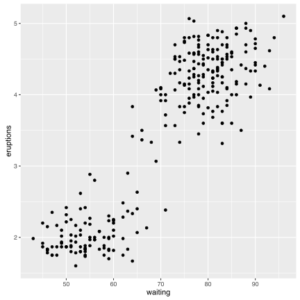
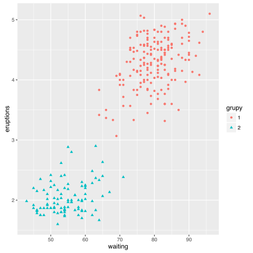
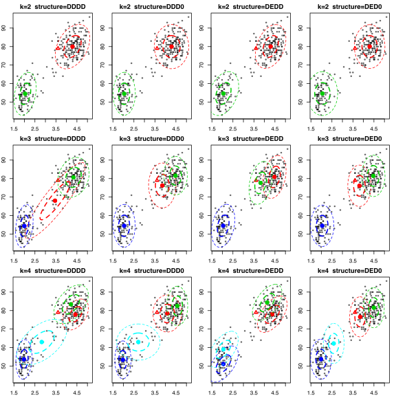
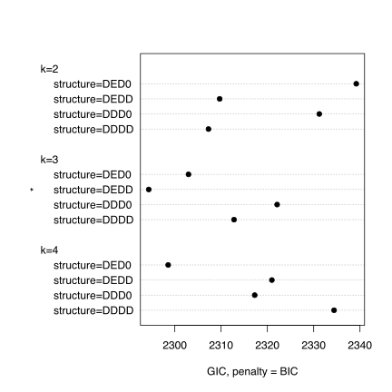

# Jak szukać partycji w oparciu o mieszaniny rozkładów?

Omawiane dotąd metody (grupowanie hierarchiczne, k-średniehc, k-medoidów) nie bazowały na żadnym probabilistycznym modelu. Ot, dzieliły obserwacje na grupy obiektów bliskich sobie.

W pewnych zastosowaniach praktyczne jest założenie, że obiekty, które obserwujemy pochodzą z mieszaniny rozkładów. Rozłożenie tej mieszaniny na części niekoniecznie oznacza, że możemy każdą obserwację przypisać do jednej grupy, ale raczej, że lepiej rozumiemy jakie grupy w tej mieszaninie się znajdują.

Poniżej skupimy się na mieszaninie rozkładów normalnych, ale w podobny sposób można rozkładać rozkłady również na inne składowe (trudniej jedynie opisać strukturę zależności).

Przyjmijmy, że mamy $$k$$ rozkładów normalnych o gęstości $$f(x, \theta_i)$$, dla $$i = 1, ..., k$$, rozkłądy mogą różnić się średnią lub macierzą kowariancji $$\theta_i = (\mu_i, \Sigma_i)$$. Rozkłady te są zmieszane z prawdopodobieństwami $$\pi_i$$, brzegowa gęstość wynosi więc

$$
f(x) = \sum_{i=1}^k \pi_i f(x, \theta_i).
$$

Standardowo, parametry takiej mieszaniny estymuje sie w oparciu o metodę największej wiargodności. Maksimum funkcji wiarogodnosci znajduje się algorytmem *expectation–maximization* (w skrócie EM, Więcej o tym modelu i algorytmie EM przeczytać można w *The R Package bgmm: Mixture Modeling with Uncertain Knowledge* https://www.jstatsoft.org/article/view/v047i03).

Zauważmy jeszcze, że dla $$p$$ wymiarowych obserwacji, jedna składowa gaussowska opisana jest przez $$p$$ liczb opisujących średnią i $$p(p+1)/2$$ opisujących macierz kowariancji. Cały model z $$k$$ składowymi opisany jest przez $$k p(p+3)/2 + k - 1$$ parametrów. Liczba parametrów szybko rośnie z wymiarem danych, przez co potrzeba jest dużo obserwacji aby je wszystkie dobrze estymować. Jeżeli obserwacji nie ma zbyt dużo, to dobrym rozwiązaniem może być założenie pewnych ograniczeń na postać macierzy kowariancji $$\Sigma_i$$. Jeżeli założymy, że rozkłądy mają taką samą wariancję na każdej składowej, lub nie są skorelowane - znacząco obniżymy liczbę parametrów. 

## Przykład

Standardowym przykładem ilustrującym składowe są dane o czasach trwania erupcji i czasach pomiędzy erupcjami gajzera Old Faithful w parku Yellowstone. Już sama wstępna eksploracja tych danych pokazuje zasadność założenia o istnieniu dwóch lub większej liczy grup.
 

```r
head(faithful)
```

```
##   eruptions waiting grupy
## 1     3.600      79     2
## 2     1.800      54     1
## 3     3.333      74     2
## 4     2.283      62     1
## 5     4.533      85     2
## 6     2.883      55     1
```

```r
library(ggplot2)
ggplot(faithful, aes(waiting, eruptions)) + 
  geom_point()
```



Wykorzstajmy funkcję `unsupervised()` z pakietu `bgmm` do oszacowania parametrów mieszaniny rozkładów normalnych. Założmy dwie składowe.

Funkcja `plot()` narysuje elipsy określające kształt gęstości rozkłądów normalnych. Wynikiem jest lista, której elementy `pi`, `mu` i `cvar` przedstawiają wyestymowane parametry.


```r
library(bgmm)
erupcje2 <- unsupervised(X = faithful, k = 2)
```

```
## Error in colMeans(kX[kres$cluster == labs[i], , drop = F]): 'x' must be numeric
```

```r
plot(erupcje2)
```

```
## Error in predict.prcomp(tmp, knowns): 'newdata' must be a matrix or data frame
```

```r
erupcje2$pi
```

```
## [1] 0.1139711 0.5365925
```

```r
# składowa 1
# średnia i macierz wariancji
erupcje2$mu[1,]
```

```
## [1]  2.04300 53.90321  1.00000
```

```r
erupcje2$cvar[1,,]
```

```
##            eruptions    waiting      grupy
## eruptions 0.15583707  0.9956187 0.05797657
## waiting   0.99561869 34.7550505 0.41414141
## grupy     0.05797657  0.4141414 0.03878788
```

```r
# składowa 2
# średnia i macierz wariancji
erupcje2$mu[2,]
```

```
## [1]  4.325856 80.051356  2.000000
```

```r
erupcje2$cvar[2,,]
```

```
##            eruptions     waiting       grupy
## eruptions 0.17865587  0.76756385 0.011198422
## waiting   0.76756385 31.66690466 0.054297566
## grupy     0.01119842  0.05429757 0.005813953
```

Mając model probabilistyczny, dla każdej obserwacji można określić prawdopodobieństwo przynależności do każdej ze składowych, więc można też wyznaczyć składową MAP (ang. *maximum a posteriori*).


```r
faithful$grupy <- factor(predict(erupcje2, faithful)$class.X)
```

```
## Error in FUN(newX[, i], ...): non-numeric argument to binary operator
```

```r
ggplot(faithful, aes(waiting, eruptions, color=grupy, shape=grupy)) + 
  geom_point()
```



## Nieznana struktura, nieznana liczba składowych

Co jednak, gdy nie wiemy jaką wybrać liczbę składowych lub jakie wprowadzić ograniczenia na parametry rozkładu? 

W przypadku modeli probabilistycznych użytecznym kryterium może być kryterium Bayesowskie BIC, zdefinowane jako

$$
BIC(M) = -2 * \log likelihood(M) + |M| * log(n)
$$

gdzie $$n$$ to liczba obserwacji, $|M|$ to rozmiar modelu - liczba parametrów opisujących model a $$\log likelihood(M)$$ to funkcja log wiarogodności. 

Funkcja `unsupervisedList()` pozwala na dopasowanie do danych zbioru modeli o różnej liczbie składowych i różnej strukturze, a następnie używając funkcji `plot()` można ete modele porównać organoleptycznie


```r
erupcje <- unsupervisedList(X = as.matrix(faithful), kList = 2:4, 
                      mean = "D", between = c("D", "E"),
                      within = "D", cov = c("D", "0"))
```

```
## Error in colMeans(kX[kres$cluster == labs[i], , drop = F]): 'x' must be numeric
```

```r
plot(erupcje)
```



Lub porównać w opaerciu o kryterium BIC. Im niższa wartość kryterium tym lepiej dopasowany model. W tym przypadku najlepszy model według kryterium BIC to ten z trzema składowymi oraz o równych wariancjach i braku kowariancji.


```r
plotGIC(erupcje, penalty = "BIC")
```



```
##                     k=2      k=3      k=4
## structure=DDDD 2307.275 2312.786 2331.912
## structure=DDD0 2331.210 2322.101 2317.286
## structure=DEDD 2309.689 2294.361 2321.467
## structure=DED0 2339.197 2302.961 2298.583
```

