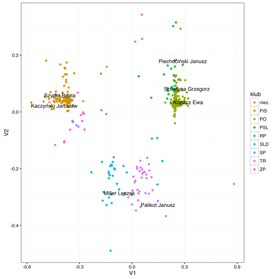

# Skalowanie metryczne

Oznaczmy przez $$x_i \in \mathcal R^p$$ współrzędne reprezentacji obiektu $$i$$ w nowej, zredukowanej przestrzeni.

Problem szukania $$p$$ wymiarowej reprezentacji można zamienić na problem optymalizacji funkcji opisującej błąd odwzorowania. Wprowadźmy następującą funkcję zniekształcenia (tzw. funkcję ang. *stress*).

$$
stress_1 = \sqrt{ \sum_{i,j} \left(d_{ij} - ||x_i - x_j||\right)^2 }
$$

Opisuje ona różnice pomiędzy zadanymi odległościami, a odległościami w nowej przestrzeni. Minimalizacja funkcji $$stress_1$$ sprowadza się do znalezienia optymalnych wartości dla współrzędnych $$x_i$$. 

Z punktu widzenia optymalizacji, możemy również minimalizować poniższą funkcję, która ma jednak taką zaletę, że wartości nie zależą już od wybranej jednostki. Zauważmy też, że dla optymalizacji nie ma również znaczenia pierwiastek. 

$$
stress_2 = \sqrt{ \frac{ \sum_{i,j} (d_{ij} - ||x_i - x_j||)^2 }{ \sum_{i,j} d^2_{i,j} } }
$$


W ogólnym przypadku minimalizacja funkcji $$stress_1$$ nie jest łatwa i wykorzystuje się do niej algorytmy iteracyjne oparte na gradientach. Ogólny schemat takiego algorytmu jest następujący.

1. Wyznacz początkowa konfigurację (może być losowa, lub oparta o skalowanie klasyczne),
2. Wyznacz macierz odległości pomiędzy obiektami w bieżącej konfiguracji $$\delta{i,j} = ||x_i - x_j||$$,
3. Wykonaj regresję odległości $$\delta_{ij}$$ na oryginalne odległości $$d_{ij}$$,
$$
d_{ij} = \alpha + \beta \delta_{ij},
$$
to nie musi być liniowa regresja, ale coś co sprowadzi $$\delta_{ij}$$ do skali $$d_{ij}$$. Oznaczmy jako $$\hat\d_{ij} = \hat\alpha + \hat\beta \delta_{ij}$$.
4. Wyznacz bieżącą wartość funkcji $$stress$$
$$
stress = \sqrt{ \frac{ \sum_{i,j} (d_{ij} - \hat\d_{ij})^2 }{ \sum_{i,j} d^2_{ij} } },
$$
5. Na bazie gradientu funkcji $$stress$$ uaktualnij współrzędne reprezentacji $$x_i$$. 

Powyższy algorytm ma wiele wariantów, różniących się np. adaptacyjnym wyborem długości kroku w punkcie 5 lub dodaniem wag. Schemat jest jednak podobny.


## Jak przeprowadzić skalowanie metryczne w R?

Funkcja `sammon()` z pakietu `MASS` wyznacza klasyczne skalowanie metyczne (nazwa pochodzi od pracy J. Sammona 1969).

Poniższy przykład wczytuje dane o głosach posłów z VII kadencji Sejmu RP na ponad 5600 głosowań. Opierając się na macierzy podobieństw wektorów głosów wyznaczmy dwu-wymiarową reprezentacje posłów. Pozycja zależy wyłącznie od tego w jaki sposób głosowano. Ale jak widzimy, posłowie tych samych klubów głosują często podobnie do siebie.


```r
library(ggplot2)
library(ggrepel)
library(MASS)
library(cluster)

glosowania <- archivist::aread("pbiecek/Przewodnik/arepo/3eab62451d26be6d14fe99dda69675ca")
podobienstwa <- daisy(glosowania[,-(1:2)])

projekcja <- as.data.frame( sammon(podobienstwa, k = 2)$points )
```

```
## Initial stress        : 0.09130
## stress after  10 iters: 0.07400, magic = 0.018
## stress after  20 iters: 0.06447, magic = 0.009
## stress after  30 iters: 0.05641, magic = 0.020
## stress after  40 iters: 0.05158, magic = 0.009
## stress after  43 iters: 0.04861
```

```r
projekcja$klub <- glosowania[,2]
projekcja$imie <- glosowania[,1]

ggplot(projekcja, aes(V1, V2, label=imie)) + 
  geom_point(aes(color=klub)) +theme_bw()
```


Zaznaczmy na tym wykresie pozycje liderów klubów.


```r
ggplot(projekcja, aes(V1, V2, label=imie)) + 
  geom_point(aes(color=klub)) +
  geom_text_repel(data=projekcja[c(268, 348, 139, 259, 168, 309, 223),]) +theme_bw()
```



