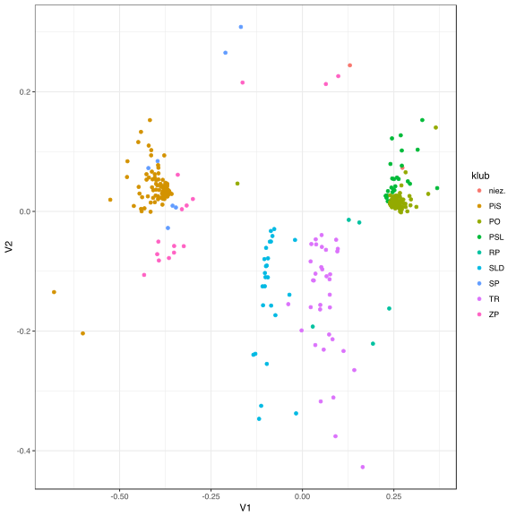

# Skalowanie nie-metryczne

W ogólnym przypadku macierz podobieństw $$D$$ może być wyznaczana w dowolny sposób. Mogą być to subiektywnie wyznaczane podobieństwa, oparte o subiektywne rankingi, pomiary odległości pomiędzy napisami, sekwencjami DNA, strukturami przestrzennymi białek, zdjęciami, dowolnymi obiektami.

W wielu sytuacjach podobieństwa mają na celu wyłącznie uporządkowanie obiektów ale nie mają samodzielnej interpretacji. Przykładowo, jeżeli porównujemy owoce, można określić, że jabłko jest bardziej podobne do gruszki niż do jagody. Takie względne podobieństwo możemy zapisać liczbami, ale wartość tych liczb nie musi mieć znaczenia, znaczenie będzie miało wyłącznie uporządkowanie. 

Skalowanie nie-metryczne pozwala na znalezienie reprezentacji, która odwzorowuje kolejność odległości pomiędzy parami obiektów a nie odległość pomiędzy obiektami. 

Wprowadźmy następującą funkcję zniekształcenia (tzw. funkcję ang. *stress*).

$$
stress = \sqrt{ \frac{\sum_{i,j} (f(d_{ij}) - ||x_i - x_j||)^2}{\sum_{i,j}  ||x_i - x_j||^2} }
$$

We wzorze powyżej $$f()$$ oznacza monotoniczną rosnącą funkcję przekształcającą odległości pomiędzy obiektami ale zachowującą ich kolejność. Ta funkcja jest również optymalizowana w procesie minimalizacji współczynnika $$stress$$.

Ogólny schemat algorytmu skalowania nie-metrycznego jest następujący.

1. Wyznacz początkowa konfigurację (może być losowa, lub oparta o skalowanie klasyczne),
2. Wyznacz macierz odległości pomiędzy obiektami w bieżącej konfiguracji $$\delta{i,j} = ||x_i - x_j||$$,
3. Wykonaj regresję porządkową odległości $$\delta_{ij}$$ na oryginalne odległości $$d_{ij}$$,
$$
d_{ij} = f( \delta_{ij} ).
$$
Zamiast przeprowadzać regresję porządkową (ang. *isotonic regression*) można też estymować $$f()$$, na bazie tej regresji wyznacz $$\hat d_{ij}$$,
4. Wyznacz bieżącą wartość funkcji $$stress$$
$$
stress = \sqrt{ \frac{ \sum_{i,j} (d_{ij} - \hat\delta_{ij})^2 }{ \sum_{i,j} d^2_{i,j} } },
$$
5. Na bazie gradientu funkcji $$stress$$ uaktualnij współrzędne reprezentacji $$x_i$$. 


## Jak przeprowadzić skalowanie nie-metryczne w R?

Funkcja `isoMDS()` z pakietu `MASS` wyznacza skalowanie niemetryczne.

Poniżej zastosujemy ją na tych samych danych co w poprzednim rozdziale.


```r
library(ggplot2)
library(ggrepel)
library(MASS)
library(cluster)

glosowania <- archivist::aread("pbiecek/Przewodnik/arepo/3eab62451d26be6d14fe99dda69675ca")
podobienstwa <- daisy(glosowania[,-(1:2)])

mds2 <- isoMDS(podobienstwa, k = 2)
```

```
## initial  value 11.618214 
## iter   5 value 6.680174
## iter  10 value 5.892581
## iter  15 value 5.805270
## final  value 5.776026 
## converged
```

```r
projekcja <- as.data.frame( mds2$points )
projekcja$klub <- glosowania[,2]
projekcja$imie <- glosowania[,1]

ggplot(projekcja, aes(V1, V2, label=imie)) + 
  geom_point(aes(color=klub)) +theme_bw()
```



Zaznaczmy na tym wykresie pozycje liderów klubów.


```r
ggplot(projekcja, aes(V1, V2, label=imie)) + 
  geom_point(aes(color=klub)) +
  geom_text_repel(data=projekcja[c(268, 348, 139, 259, 168, 309, 223),]) +theme_bw()
```


## Inne materiały

* Sameer Agarwal i inni o *Generalized Non-metric Multidimensional Scaling* https://homes.cs.washington.edu/~sagarwal/nmds.pdf


