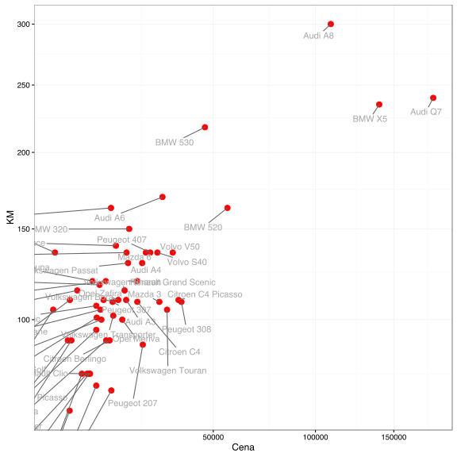
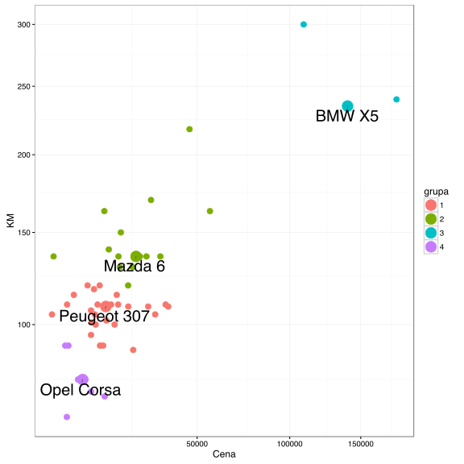
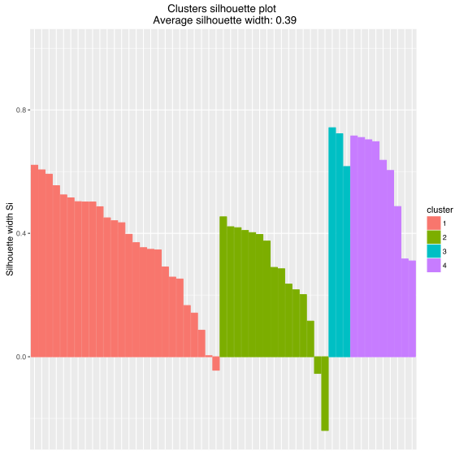

# Jak szukać partycji w oparciu o metodę k-medoidów?

Największą zaletą algorytmu k-średnich jest efektywność obliczeniowa. Wyznaczanie średnich i przypisywanie do najbliższej średniej jest algebraicznie szybkie, łatwo się zrównolegla, przez co można stosować te algorytm do dużych baz danych. 

Niestety, jak widzieliśmy, opiera się on o kwadrat odległości Euklidesowej. Nie zawsze akurat taka miara podobieństwa nas interesuje. Taka miara jest też bardzo wrażliwa na duże odległości i pojedyncza wartość odstająca może znacząco wpłynąć na sumę kwadratów odległości.

Algorytm k-medoidów pozwoli nam wykorzystywać inne miary odległości za cenę wyższej złożoności obliczeniowej.


# Algorytm

Algorytm PAM (*Partitioning Around Medoids*, nazywany dalej algorytmem k-medoidów) jest następujący

1. Zainicjuj algorytm wybierając losowe obiekty jako medoidy/centra/reprezentantów grup.

2. Dla wszystkich obiektów wyznacz ich przypisanie na zasadzie odległości od najbliższego medoidu. 
$$
C(i) = arg\min_k d(x_i, m_k),
$$
gdzie $$m_k$$ to medoid grupy $$k$$.

3. Dla każdej grupy, sprawdź czy inny obiekt z tej grupy nie ma mniejszej sumy odległości od wszystkich pozostałych w tej grupie. Jeżeli tak, to to on powinien być nowym medoidem.
$$
m'_k = x_{r(k)},
$$
$$
r(k) = arg\min_{i: C(x_i) = k} \sum_{j: C(x_j) = k} d(x_i, x_j).
$$

4. Powtarzaj kroki 2-3 tak długo póki zmienia się przypisanie do grup $$C(x_i)$$. 


## Przykład

Podobnie jak dla algorytmu k-średnich poniższą analizę grup przeprowadzimy na wybranych 57 modelach aut, opierając się na zbiorze danych `auta2012` z pakietu `PogromcyDanych`. Policzyliśmy wcześniej na podstawie dwuletnich ofert, średnią cenę, przebieg, pojemność silnika, liczbę koni mechanicznych i frakcję aut z silnikiem diesla. 

Algorytm k-medoidów może działać na uprzednio wyznaczonej macierzy odległości, wyznaczmy więc ją w oparciu o odległość Manhattan.


```r
auta <- archivist::aread("pbiecek/Przewodnik/arepo/bf2846de03bc8434d234b08fd2e31694")
auta$nazwa <- rownames(auta)
auta$Cena_norm <- scale(sqrt(auta$Cena))
auta$KM_norm <- scale(sqrt(auta$KM))
odleglosci <- dist(auta[,c("Cena_norm", "KM_norm")], method = "manhattan")
as.matrix(odleglosci)[1:5,1:5]
```

```
##           Audi A3   Audi A4  Audi A6  Audi A8  Audi Q7
## Audi A3 0.0000000 0.7184849 1.888609 6.550862 6.980737
## Audi A4 0.7184849 0.0000000 1.170124 5.832377 6.262252
## Audi A6 1.8886091 1.1701242 0.000000 4.662253 5.092128
## Audi A8 6.5508616 5.8323767 4.662253 0.000000 2.415564
## Audi Q7 6.9807367 6.2622518 5.092128 2.415564 0.000000
```

Przypomnijmy wykres przedstawiający wybrane parametry dla wybranych marek.


```r
library(ggrepel)
ggplot(auta, aes(Cena, KM, label=nazwa)) +
  geom_point(size=3, color="red") +
  geom_text_repel(color="darkgrey") + theme_bw() +
  coord_trans("sqrt", "sqrt")
```



Przyjmijmy, że chcemy znaleźć 4 grupy. 

Do znalezienia podziału wykorzystajmy funkcję `pam()` z pakietu `cluster`.


```r
library(cluster)
grupy <- pam(odleglosci, k=4)
```

Wynikiem jest lista, zawierająca między innymi pole `clustering` z informacją o przypisaniach kolejnych obserwacji oraz `centers` z informacją o zidentyfikowanych środkach grup.


```r
head(grupy$clustering)
```

```
## Audi A3 Audi A4 Audi A6 Audi A8 Audi Q7 BMW 316 
##       1       2       2       3       3       1
```

```r
grupy$medoids
```

```
## [1] "Peugeot 307" "Mazda 6"     "BMW X5"      "Opel Corsa"
```

```r
grupy$id.med
```

```
## [1] 31 22 12 24
```

Wykorzystajmy obie te wartości aby narysować auta po podzieleniu na grupy. Dodatkowo wyróżnimy środki grup.


```r
auta$grupa = factor(grupy$clustering)
centra <- auta[grupy$id.med,]

ggplot(auta, aes(Cena, KM, label=nazwa, color=grupa)) +
  geom_point(size=3) + theme_bw() +
  geom_point(data=centra, size=6) +
  geom_text_repel(data=centra, color="black", size=7) + 
  coord_trans("sqrt", "sqrt")
```



## Sylwetki grup

Do diagnostyki pogrupowania wykorzystuje się często tzw. sylwetki (ang. *silhouette*).  
Są to wykresu, przedstawiające dla każdego obiektu informację na ile blisko temu obiektowi do wszystkich pozostałych z jego grupy w stosunku do wszystkich pozostałych z innej, najbliższej grupy.

Formalnie, możemy tę wartość zapisać jako 

$$
s(i) = \frac{b(i) - a(i)}{\max(a(i), b(i))},
$$
gdzie $$a(i)$$ to średnia odległość obserwacji $$x_i$$ od pozostałych z jej grupy, a $$b(i)$$ to najmniejsza ze średnich odległości do pozostałych grup.

$$
a(i) = \frac{1}{\#\{j: C(x_j) = C(x_i)\}}\sum_{j: C(x_j) = C(x_i)} d(x_i, x_j)
$$
$$
b(i) = \min_{k \neq C(x_i)} \frac{1}{\#\{j: C(x_j) = k\}}\sum_{j: C(x_j) = k} d(x_i, x_j)
$$

Im bliższa $$s(i)$$ wartości 1, tym bardziej dany obiekt pasuje do swojej grupy, im bliższa wartości -1, tym bliżej temu obiektowi do grupy sąsiedniej.


```r
library(factoextra)
sylwetka <- silhouette(grupy$clustering, odleglosci)
sylwetka[1:6,]
```

```
##      cluster neighbor sil_width
## [1,]       1        2 0.5544012
## [2,]       2        1 0.2354746
## [3,]       2        1 0.4535087
## [4,]       3        2 0.6164420
## [5,]       3        2 0.7226221
## [6,]       1        4 0.1658866
```

```r
fviz_silhouette(sylwetka)
```

```
##   cluster size ave.sil.width
## 1       1   26          0.37
## 2       2   15          0.26
## 3       3    3          0.69
## 4       4    9          0.58
```



