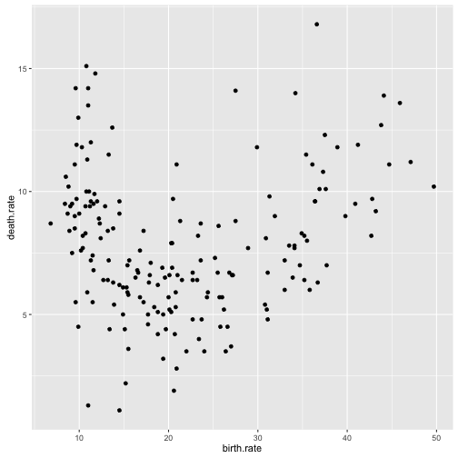
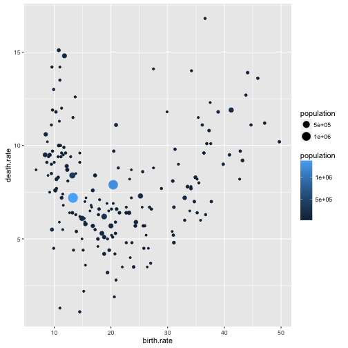
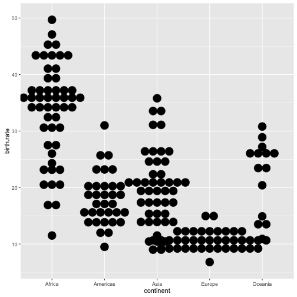
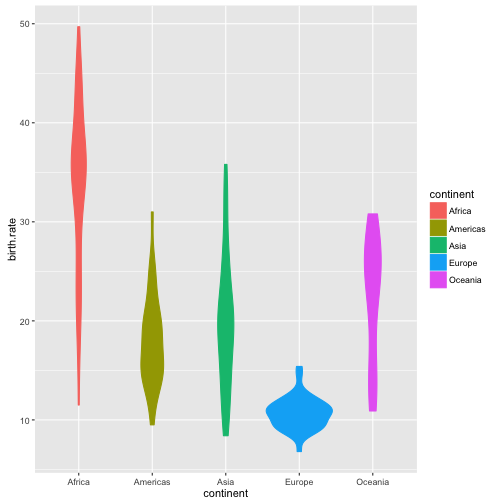
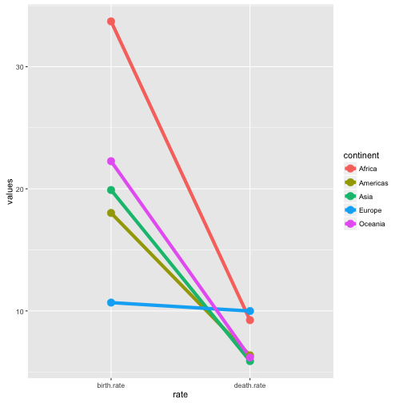
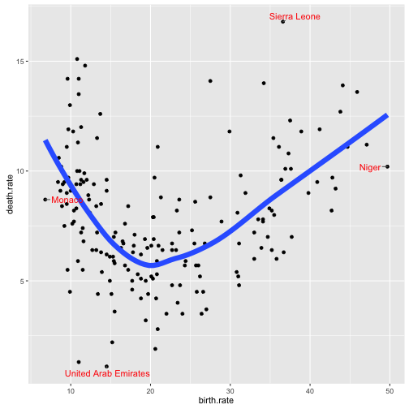

# Jak tworzyć wykresy z pakietem ggplot2?

Pakiet `ggplot2` jest jednym z najbardziej zaawansowanych narzędzi do tworzenia wykresów statystycznych. Zaawansowanie nie oznacza, że można w nim wykres zrobić szybko, ani też że dostępnych jest wiele cukierkowych wykresów, ale że konstrukcja pakietu jest na tyle elastyczna, że można z nim wykonać praktycznie każdą grafikę statystyczną.

Tą elastyczność uzyskuje się opierając opis wykresu na sposobie w jaki myślimy i czytamy wykresy. Patrząc na wykres nie widzimy w nim zbioru odcinków i kółek, ale kolekcje obiektów na swój sposób podobnych lub różnych. Gramatyka grafiki jest szerzej opisana [w tym eseju](http://biecek.pl/Eseje/indexGramatyka.html).

Poniższe przykłady oparte są o dwa zbiory danych. Zbiór `countries` ze współczynnikami dzietności / umieralności dla różnych krajów oraz zbiór `maturaExam` z wynikami matur w kolejnych latach.


```r
library(SmarterPoland)
head(countries)
```

```
##               country birth.rate death.rate population continent
## 1         Afghanistan       34.1        7.7      30552      Asia
## 2             Albania       12.9        9.4       3173    Europe
## 3             Algeria       24.3        5.7      39208    Africa
## 4             Andorra        8.9        8.4         79    Europe
## 5              Angola       44.1       13.9      21472    Africa
## 6 Antigua and Barbuda       16.5        6.8         90  Americas
```

```r
head(maturaExam)
```

```
##   id_ucznia punkty  przedmiot  rok
## 1         4     14 matematyka 2011
## 2         4     31  j. polski 2011
## 3         5     19 matematyka 2010
## 4         5     35  j. polski 2010
## 5         7     16 matematyka 2010
## 6         7     43  j. polski 2010
```

## Jak zrobić pierwszy wykres?

Minimalny wykres z pakietem `ggplot2` składa się przynajmniej z trzech elementów. 

* Funkcja `ggplot()` tworzy zrąb wykresu. W tym miejscu deklaruje się parametry wspólne dla pozostałych elementów wykresu. Deklaracja może być pusta, ale zazwyczaj wskazuje się tutaj zbiór danych (poniżej `countries`) i mapowania (poniżej funkcja `aes()`).
* Funkcje `geom_`/`stat_` tworzą kolejne warstwy prezentacji danych. Poniżej wykorzystywana jest funkcja `geom_point()` tworząca warstwę wykresu prezentującą dane. 
* Operator `+` łączy opisu kolejnych elementów wykresu.

Zbudujmy więc wykres, przedstawiający za pomocą punktów informacje o częstości narodzin i zgonów dla różnych krajów.


```r
library(ggplot2)
library(tidyr)

ggplot(countries, aes(x=birth.rate, y=death.rate)) +
  geom_point()
```



Gramatyka zaimplementowana w pakiecie `ggplot2` pozwala na budowę wykresów o strukturze przedstawionej na poniższej grafice. 

Składa się na z wielu elementów.
Omówimy je jeden po drugim.


## Jak określać mapowania?

Wykresy przedstawiają kolekcje obiektów, które są opisane przez atrybuty graficzne. Geometrie określają co to za kolekcje, a mapowania określają które atrybuty wykresów kodują dane.

Mapowania są opisane wewnątrz funkcji `aes()` (od *aesthetic*). Są to pary *atrybut graficzny* - *nazwa zmiennej*.

Dla każdej geometrii określone jest jakie atrybuty graficzne mogą przedstawiać dane. Lista dla geometrii `geom_point` znajduje się pod adresem http://docs.ggplot2.org/current/geom_point.html. Obowiązkowe atrybuty to `x` i `y` - współrzędne punktów. Na poniższym wykresie określamy mapowania też też dla atrybutu kolor (`color`) i kształt (`shape`). 


```r
ggplot(countries, aes(x=birth.rate, y=death.rate, 
                      color=continent, shape=continent)) +
  geom_point()
```


Określając mapowanie *kształt* - *kontynent* żądamy by kształty punktów odpowiadały kontynentom, ale nie określamy jaki kształt ma określać który kontynent.  

Sposób mapowania wybiera biblioteka `gpglot2` na podstawie typu zmiennej do przedstawienia i liczby poziomów, które mają być przedstawione.

Przykładowo, na poprzednim wykresie przedstawialiśmy kontynent za pomocą kolorów. Kolory są tak dobierane by możliwie ułatwić rozróżnienie poszczególnych kontynentów. Nie ma jednak żadnego założonego porządku pomiędzy kontynentami.

Na poniższym przykładzie kolor mapujemy na zmienną ilościową - populacja. Tutaj jest już porządek i jest on odzwierciedlony przez skalę kolorów rozpinającą się od niebieskiego po czerń.


```r
ggplot(countries, aes(x=birth.rate, y=death.rate, 
                      color=population, size=population)) +
  geom_point()
```



## Jak określać geometrię?

Geometria określa kolekcje kształtów, które prezentują dane.
Mogą to być punkty (patrz `geom_point()`), linie, prostokąty, obszary, różne kształty.

Lista dostępnych obecnie geometrii dostępnych jest na stronie  http://docs.ggplot2.org/current/. Pakiet `ggplot2` ma również mechanizmy pozwalające na tworzenie nowych geometrii, np. [przedstawianie danych za pomocą małych choinek](http://smarterpoland.pl/index.php/2015/12/geom_christmas_tree-a-new-geom-for-ggplot2-v2-0/).

Poniżej przedstawiamy przykłady geometrii `geom_dotplot` (ułożone na sobie punkty), `geom_violin` (skrzypce), `geom_line` (linie).


```r
ggplot(countries, aes(x = continent, y = birth.rate)) +
  geom_dotplot(binaxis = "y", stackdir = "center")
```



```r
ggplot(countries, aes(x = continent, y = birth.rate, color=continent,fill=continent)) +
  geom_violin()
```



```r
countries %>% 
  gather(rate, values, birth.rate, death.rate) %>%
  group_by(continent, rate) %>%
  summarise(values = mean(values, na.rm=TRUE)) %>%
  ggplot(aes(x = rate, y = values, group=continent, color=continent)) +
  geom_line(size=2) +
  geom_point(size=4) 
```



## Jak składać kilka geometrii?

Tworzenie złożonych i bogatych w treść grafik jest w `ggplot2` możliwe dzięki składaniu warstw. 
Wszystkie warstwy istnieją we wspólnych ramach układu współrzędnych, przez to można łatwiej porównywać obiekty pomiędzy nimi. 
Daje to duże możliwości budowy wielowarstwowych grafik o uzupełniających się treściach.

Dodanie kolejnej warstwy odbywa się przez dodanie operatorem `+` kolejnej geometrii.
Poniżej przedstawiam przykład wykresu z trzema warstwami. Są to kolejno warstwa z punktami, krzywą trendu i nazwami wybranych krajów.

Warstwy te uzupełniają się. W głównym planie jest linia z trendem, punkty pełnią rolę uzupełniającą w drugim planie. Napisami zaznaczono najbardziej skrajne kraje.


```r
library(ggrepel)

ggplot(countries, aes(x=birth.rate, y=death.rate, label=country)) +
  geom_point() + 
  geom_smooth(se=FALSE, size=3) + 
  geom_text_repel(data=countries[c(108,120,176,148),], color="red")
```



## Jak określać statystyki?


## Jak tworzyć panele?


## Jak modyfikować położenie elementów?


## Jak modyfikować skale?


## Jak modyfikować układ współrzędnych?


## Jak modyfikować styl wykresu?


