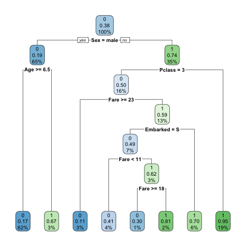
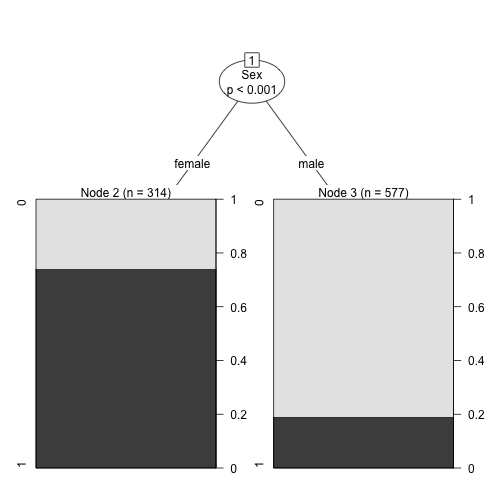
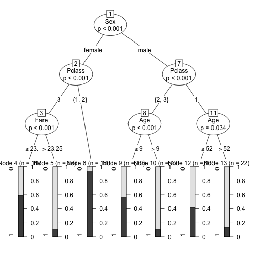
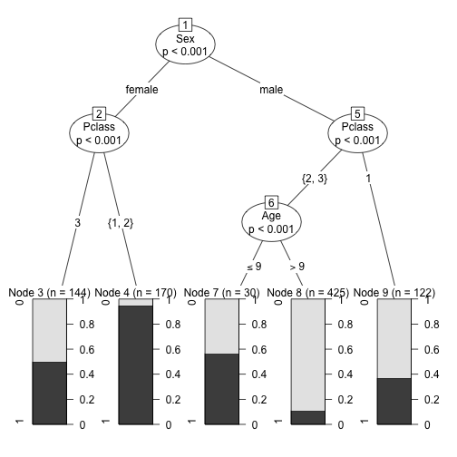

# Jak hodować drzewa decyzyjne?

Jedną z najpopularniejszych technik konstrukcji modeli predykcyjnych są drzewa decyzyjne. 
Ich główną zaletą jest prosta interpretacja, oraz (relatywnie) prosta konstrukcja.
Ich główną wadą jest duża wariancja a co idzie w parze, podatność na tzw. przeuczenie.

Ale po kolei.

## Drzewa klasyfikacyjne, regresyjne, ...

Poniżej omówimy drzewa klasyfikacyjne, a więc takie, które opisują zmienną jakościowa występującą w dwóch lub większej liczbie klas.  

Jednak w bardzo podobny sposób można skonstruować drzewa opisujące zmienną ciągłą (tzw. drzewa regresyjne), zmienna cenzurowaną lub inną zmienną.

Do przedstawienia zagadnienia konstrukcji drzewa decyzyjnego wykorzystamy zbiór danych o pasażerach statku Titanic. Interesować nas będzie jakie zmienne wpływają na to czy pasażer przeżył czy nie.


```r
library(Przewodnik)
head(titanic)
```

```
##   Survived Pclass    Sex Age    Fare Embarked
## 1        0      3   male  22  7.2500        S
## 2        1      1 female  38 71.2833        C
## 3        1      3 female  26  7.9250        S
## 4        1      1 female  35 53.1000        S
## 5        0      3   male  35  8.0500        S
## 6        0      3   male  NA  8.4583        Q
```


## Generyczne drzewo

Ogólny schemat budowy binarnego drzewa decyzyjnego wygląda następująco.

1. Rozpoczynamy ze zbiorem `p` zmiennych opisujących n obserwacji, naszym celem jest budowa drzewa opisującego zmienną y.
2. Dla każdego zbioru wykonujemy takie kroki
  a. Dla każdej z `p` zmiennych rozważamy wszystkie możliwe binarne podziały tej zmiennej,
  b. Dla każdego możliwego podziału wygenerowanego przez wybraną zmienną sprawdzamy jak zmieni się miara zróżnicowania zmiennej `y` w dwóch uzyskanych podzbiorach. Jako kandydujący podział wybieramy taki, który maksymalizuje zmianę miary zróżnicowania.
  c. Jeżeli spełnione są warunki podziału, to dzielimy zbiór na dwa podzbiory i wracamy do kroku 2. Jednym z warunków podziału jest by miara zróżnicowana zmiennej `y` po podziale zwiększyła się.

Istnieje wiele wersji szczegółowych powyższego algorytmu, w zależności od tego jakie miary i jak są maksmalizowane. Poniżej omówimy dwie najbardziej popularne.

## Rekursywne podziały

Dwa klasyczne algorytmy rekursywnego podziału to CART (Classification And Regression Tree) i rodzina klasyfikatorów ID3, C4.5, C5.0 (rozwijane przez Rossa Quinlan). 

W obu algorytmach drzewo budowane jest w sposób rekursywny. Dla każdego węzła w drzewie wybierany jest optymalny podział elementów tego węzła na dwie grupy w oparciu o pojedynczą zmienną. Algorytmy te różnią się miarą wykorzystywaną do oceny który podział jest najlepszy.

W algorytmie CART wykorzystywana jest miara ,,czystości'' węzła *Gini impurity*. Jest ona wyznaczana jako prawdopodobieństwo, że losowo wybrany element będzie niepoprawnie zaklasyfikowany, jeżeli klasyfikacja jest wykonywana losowo z zachowaniem proporcji w węźle. 

Wybierany jest podział, który maksymalizuje czystość węzłów.

$$
I_G(p) = \sum_i p_i(1-p_i) = 1 - \sum_i p_i^2.
$$
W algorytmie C4.5 i C5.0 wykorzystywany jest współczynnik *Information gain*, wyznaczany jako entropia węzła rodzica minus suma ważonych entropii węzłów pochodnych. Gdzie entropia jest wyznaczana jako

$$
E(p) = - \sum_i p_i \log_2 p_i.
$$

Podział jest powtarzany tak długo, aż osiągnięty jest warunek stopu.

W pakiecie `rpart` zaimplementowany jest algorytm CART. W pakiecie `C50` zaimplementowany jest algorytm C5.0.


```r
library(rpart)
library(rpart.plot)

drzewo <- rpart(Survived~., data=titanic)
rpart.plot(drzewo)
```



Więcej informacji o tym jak rysować ładniejsze drzewa http://www.milbo.org/rpart-plot/prp.pdf

## Warunkowe testowanie

Szczegółowy opis tego algorytmu znajduje się na stronie
https://cran.r-project.org/web/packages/partykit/vignettes/ctree.pdf

Tym razem będziemy chcieli naprawić problemy wyżej przedstawionej implementacji:

1. przeuczenie, o ile nie stosuje się dodatkowych warunków zatrzymania podziału węzłów,
2. tzw. *selection bias* wynikający z tego, że zmienne mające wiele możliwych punktów podziału mają większą szansę na bycie wybranymi w skutek czysto losowych fluktuacji.

W tym podejściu wykorzystamy testy statystyczne by kontrolować oba powyższe problemy.

Procedura budowy drzewa jest następująca:

1. Rozpoczynamy ze zbiorem `p` zmiennych opisujących n obserwacji, naszym celem jest budowa drzewa opisującego zmienną y.
2. Dla każdego zbioru wykonujemy test weryfikujący czy którakolwiek ze zmiennych p jest istotnie statystycznie zależna od zmiennej `y`. Jeżeli hipoteza zerowa nie zostanie odrzucona to przerywamy dalszy podział tego zbioru. Jeżeli zostanie odrzucona to przechodzimy z tym zbiorem do kolejnego kroku.
3. Wybieramy zmienną $X_i$ ze zbioru `p` zmiennych o najsilniejszej zależności od zmiennej `y`. 
4. Dla zmiennej $X_i$ wyznacz optymalny podział zmiennej na dwa rozłączne podzbiory. Z dwoma tak utworzonymi zbiorami powróć do kroku 2.

### Hipoteza globalna

Kroki 2 i 3 oparte są o test permutacyjny, który z kolei oparty jest o następującą statystykę dla $i$ tej zmiennej.

$$
T_i = \sum_j g_j(x_{ij})h(y_j, Y)^T.
$$
Funkcje $g()$ i $h()$ zależą od charakteru zmiennej $y$ (ciągła, cenzurowana, dyskretna). 

Zauważmy, że statystyka $T_i$ nie musi być jednowymiarowa, jej wymiar zależy od funkcji $g()$, która zmienną objaśniającą może zakodować jako kilka tzw. dummy variables (częste dla zmiennych jakościowych), oraz funkcji $h()$, która dla wielowymiarowego $y$ również może mieć więcej niż jedną współrzędną.

Statystyka $T_i$ jest redukowana do statystyki jednowymiarowej przez uprzednie ustandaryzowanie a następnie zastosowanie jednej z dwóch transformacji, wartości maksymalnej składowych albo sumy kwadratów.

$$
T_{i,max} = \max_{p,q} s(T_{i}^{p,q})
$$
$$
T_{i,quad} = \sum_{p,q} s(T_{i}^{p,q})^2
$$

Statystyki testowe nie mogą być bezpośrednio porównywane z uwagi na różne skale (wynikające np. z różnej liczby składowych $p,q$).

Aby móc porównywać zmienne, dla każdej zmiennej, na podstawie statystyki testowej, wyznaczana jest p-wartość. 

Hipoteza globalna o łącznym wpływie zmiennych jest weryfikowana na podstawie minimalnej p-wartości, po ewentualnej korekcie Bonferroniego.

### Optymalny podział

W kroku 4. dla wybranej zmiennej wybierany jest optymalny podział. Również on oparty jest o test permutacyjny. 

Dla różnych podziałów na dwie grupy wyznaczana jest statystyka $T_i$. Optymalny podział wyznaczany jest przez maksymalizację wartości statystyki testowej.


## Przykłady w R

Zbudujmy jednopoziomowe drzewo decyzyjne dla zmiennej `Survived` ze zbioru danych `titanic`.


```r
library(party)
drzewo <- ctree(Survived~., data=titanic, 
                controls = ctree_control(maxdepth=1))
plot(drzewo)
```



Argumentem `ctree_control` możemy określić dodatkowe parametry, takie jak maksymalna głębokość drzewa.


```r
drzewo <- ctree(Survived~., data=titanic, 
                controls = ctree_control(maxdepth=3))
plot(drzewo)
```



Również tym argumentem możemy określić sposób korekty p-wartości, poziom istotności dla testu, sposób redukcji statystyki testowej, minimalna wielkość węzła do podziału.


```r
drzewo <- ctree(Survived~., data=titanic, 
                controls = ctree_control(maxdepth=3,
                                        teststat = "quad",
                                        testtype = "Bonferroni",
                                        mincriterion = 0.9999,
                                        minsplit = 5))
plot(drzewo)
```



Zmienna objaśniana może być jednowymiarowa, wielowymiarowa, jakościowa, ilościowa lub nawet cenzorowana.

Poniżej prezentujemy przykład dla analizy przeżycia pacjentek chorych na BRCA.


```r
drzewo <- ctree(Surv(time/365, death)~., 
                data=brca, 
                controls = ctree_control(maxdepth=2))
plot(drzewo)
```


