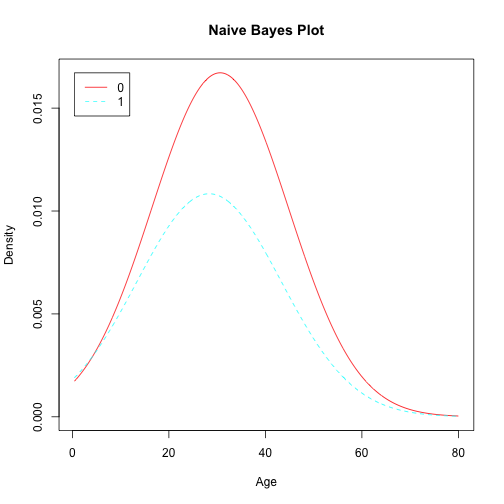

# Naiwny Bayes

## Jak to działa?

Interesuje nas modelowanie rozkładu $y|X$. Z twierdzenia Bayesa mamy

$$
P(y_i = 1| X_i = x_i) = \frac{P(X_i = x_i | y_i = 1)P(y_i = 1)}{P(X_i = x_i)} = 
$$
$$
 = \frac{P(X_i = x_i | y_i = 1)P(y_i = 1)}{\sum_k P(X_i = x_i | y_i = k)P(y_i = k)}
$$
Klasyfikator Naiwny Bayes zawdzięcza połowę swojej nazwy ww. twierdzeniu, a drugą połowę założeniu warunkowej niezależności składowych wektora $X$ pod warunkiem $y$.

Zakładamy, że
$$
P(X_i = x_i | y_i = k) = \prod_j P(X_{i,j} = x_{i,j} | y_i = k)
$$
gdzie $X_{i,j}$ to $j$ta składowa wektora $X_i$.
  
Zobaczmy więc, jak wygląda log-szansa 
$$
\log (odds_i) = \log \frac{P(X_i = x_i | y_i = 1)P(y_i = 1)}{P(X_i = x_i | y_i = 0)P(y_i = 0)} = \log \frac{\prod_j P(X_{i,j} = x_{i,j} | y_i = 1)P(y_i = 1)}{\prod_j P(X_{i,j} = x_{i,j} | y_i = 0)P(y_i = 0)} =
$$


$$
= \sum_j \log \frac{P(X_{i,j} = x_{i,j} | y_i = 1)}{P(X_{i,j} = x_{i,j} | y_i = 0)} + \log \frac{P(y_i = 1)}{P(y_i = 0)} 
$$
Ten wzór wygląda już zdecydowanie lepiej. Każdy jego człon można estymować, ponieważ z jednej strony mamy jednowymiarowe warunkowe rozkłady a z drugiej brzegowe częstości etykiet $y$.

Dla zmiennych dyskretnych $x_{i,j}$, rozkład warunkowy estymuje się bezpośrednio przez empiryczne częstości. Dla zmiennych ciągłych $x_{i,j}$, rozkład warunkowy można estymować albo korzystając z jądrowego estymatora gęstości albo zakładając, że $x_{i,j} \sim N(\mu_{j,1}, \sigma_{j,1})$. 

Warto zauważyć przy okazji, że po wyestymowaniu współczynników otrzymujemy funkcje o strukturze

$$
\log (odds_i) = \sum_j \underbrace{\log \frac{P(X_{i,j} = x_{i,j} | y_i = 1)}{P(X_{i,j} = x_{i,j} | y_i = 0)}}_{g_j(x_{i,j})}  + \underbrace{\log \frac{P(y_i = 1)}{P(y_i = 0)}}_{c}
$$
Czyli log-szansa jest modelowana z użyciem GAM (generalized additive models), gdzie każda zmienna $j$ ma niezależny, addytywny wpływ na szacowaną log-szansę.
  
## Jak to zrobić w R?

Przykłady klasyfikacji dla metody Naiwny Bayes przedstawimy na danych o przeżyciach z katastrofy statku Titanic. 


```r
library("Przewodnik")
head(titanic)
```

```
##   Survived Pclass    Sex Age    Fare Embarked
## 1        0      3   male  22  7.2500        S
## 2        1      1 female  38 71.2833        C
## 3        1      3 female  26  7.9250        S
## 4        1      1 female  35 53.1000        S
## 5        0      3   male  35  8.0500        S
## 6        0      3   male  NA  8.4583        Q
```

Funkcja `e1071::naiveBayes()` dla zmiennych jakościowych wyznacza tabele częstości, a dla zmiennych ilościowych estymuje parametry rozkładu normalnego, czyli średnią i odchylenie standardowe. 

Wynikiem tej funkcji są wyestymowane współczynniki. 

Można też wykorzystać funkcję `predict()` aby wyznaczać predykcje dla nowych wartości $X$.


```r
library("e1071")
nb <- naiveBayes(Survived~Sex+Pclass+Age, data = titanic)
nb
```

```
## 
## Naive Bayes Classifier for Discrete Predictors
## 
## Call:
## naiveBayes.default(x = X, y = Y, laplace = laplace)
## 
## A-priori probabilities:
## Y
##         0         1 
## 0.6161616 0.3838384 
## 
## Conditional probabilities:
##    Sex
## Y      female      male
##   0 0.1475410 0.8524590
##   1 0.6812865 0.3187135
## 
##    Pclass
## Y           1         2         3
##   0 0.1457195 0.1766849 0.6775956
##   1 0.3976608 0.2543860 0.3479532
## 
##    Age
## Y       [,1]     [,2]
##   0 30.62618 14.17211
##   1 28.34369 14.95095
```

Klasyfikator Naiwny Bayes jest też dostępny w innych funkcjach i pakietach. 
Przykładowo, implementacja z pakietu `klaR` przedstawia graficznie wyestymowane gęstości brzegowe.


```r
library("klaR")
nb <- NaiveBayes(Survived~Age, data=na.omit(titanic))
plot(nb)
```



