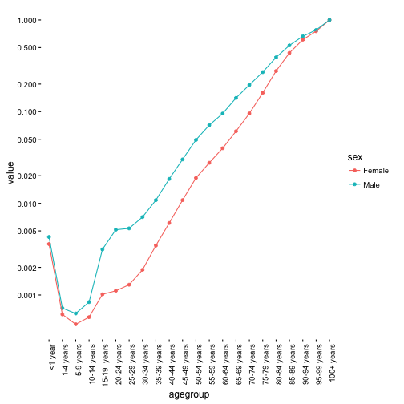

# Jak pobrać dane z...?

Poniżej opiszemy kilka użytecznych źródeł danych dostępnych w Internecie.
Liczba interesujących źródeł przyrasta w niesamowitym tempie. Poniższe bazy są najczęściej bardzo bogate i umożliwiają porównani pomiędzy krajami.


## Bazy danych Światowej Organizacji Zdrowia (World Health Organization, WHO)

Światowa Organizacja Zdrowia, WHO, działa w ramach ONZ i zajmuje się ochroną zdrowia (http://www.who.int/en/). Udostępnia setki tabel przedstawiających jak różnorodne wskaźniki zdrowotne zmieniają się w różnych krajach, regionach.

Aby pobrać dane bezpośrednio z serwerów WHO można wykorzystać pakiet `WHO` dostępny na serwerach CRAN (https://cran.r-project.org/web/packages/WHO/index.html).

Przedstawimy kluczowe funkcje pozwalające na podanie danych na przykładzie współczynnika śmiertelności.

Zaczniemy od pobrania słownika z listą wszystkich nazw i opisów tabel, można to wykonać funkcją `get_codes()`. Następnie wybierzemy tylko te, które w opisie mają słowo `dying`.


```r
library(WHO)
codes <- get_codes()
as.data.frame(codes[grep(codes$display, pattern="dying"), ])
```

```
##             label
## 1  MDG_0000000001
## 2  MDG_0000000007
## 3 LIFE_0000000030
## 4 LIFE_0000000032
## 5   WHOSIS_000004
## 6             cmr
## 7            pnmr
## 8     NCDMORT3070
##                                                                                                                                      display
## 1                                                  Infant mortality rate (probability of dying between birth and age 1 per 1000 live births)
## 2                                                             Under-five mortality rate (probability of dying by age 5 per 1000 live births)
## 3                                                                                          nqx - probability of dying between ages x and x+n
## 4                                                                                        ndx - number of people dying between ages x and x+n
## 5                                                    Adult mortality rate (probability of dying between 15 and 60 years per 1000 population)
## 6                                                   Child mortality rate (probability of dying between age 1 and age 5 per 1000 live births)
## 7                                  Postneonatal mortality rate (probability of dying between age 30 days and 11 months per 1000 live births)
## 8 Probability (%) of dying between exact ages 30 and 70 from any of cardiovascular disease, cancer, diabetes, or chronic respiratory disease
##                                                                               url
## 1    http://apps.who.int/gho/indicatorregistry/App_Main/view_indicator.aspx?iid=1
## 2    http://apps.who.int/gho/indicatorregistry/App_Main/view_indicator.aspx?iid=7
## 3   http://apps.who.int/gho/indicatorregistry/App_Main/view_indicator.aspx?iid=30
## 4   http://apps.who.int/gho/indicatorregistry/App_Main/view_indicator.aspx?iid=32
## 5   http://apps.who.int/gho/indicatorregistry/App_Main/view_indicator.aspx?iid=64
## 6                                                                                
## 7                                                                                
## 8 http://apps.who.int/gho/indicatorregistry/App_Main/view_indicator.aspx?iid=3354
```

Interesująca tabela ma identyfikator `LIFE_0000000030`. Pobierzemy ją do R (co może trochę potrwać i wymaga połączenia z Internetem) a następnie sprawdzimy jakie cechy są w tej tabeli opisane.


```r
df <- get_data("LIFE_0000000030")
colnames(df)
```

```
## [1] "publishstate"         "gho"                  "sex"                 
## [4] "worldbankincomegroup" "agegroup"             "country"             
## [7] "region"               "year"                 "value"
```

Wykorzystujemy pakiet `dplyr` by wybrać tylko dane dla Polski z roku 2013.


```r
library(dplyr)
df %>% 
  filter(year == 2013, country == "Poland") %>%
  select(agegroup, value, sex) ->
  poland2013
head(poland2013)
```

```
## Source: local data frame [6 x 3]
## 
##      agegroup    value    sex
##         (chr)    (dbl)  (chr)
## 1 95-99 years 0.754675 Female
## 2   5-9 years 0.000628   Male
## 3 60-64 years 0.039902 Female
## 4 85-89 years 0.527849   Male
## 5 25-29 years 0.001294 Female
## 6 50-54 years 0.049180   Male
```

Możemy teraz narysować śmiertelność dla obu płci. Dla mężczyzn jest znacznie wyższa niż dla kobiet.


```r
library(ggplot2)
poland2013$agegroup <- factor(poland2013$agegroup,
            c("<1 year","1-4 years","5-9 years",  "10-14 years","15-19  years", 
              "20-24 years", "25-29 years", "30-34 years", "35-39 years", 
              "40-44 years", "45-49 years", "50-54 years", "55-59 years", 
              "60-64 years",  "65-69 years", "70-74 years", "75-79 years", 
              "80-84 years", "85-89 years", "90-94 years", "95-99 years", "100+ years"))

ggplot(poland2013, 
       aes(agegroup, value, color=sex, group=sex)) +
  geom_point() + geom_line() + theme_classic() + 
  scale_y_log10(breaks=c(0.001,0.002,0.005, 0.01,0.02,0.05,0.1,0.2,0.5,1)) +
  theme(axis.text.x = element_text(angle = 90, hjust = 1))
```



## Inne narzędzia

Poza opisanymi powyżej źródłami, warto wiedzieć również o

* Pakiet `FAOSTAT` pozwala na dostęp do danych Organizacji Narodów Zjednoczonych do spraw Wyżywienia i Rolnictwa (Food and Agricultural Organization of the United Nations). Pakiet jest dostępny na serwerze CRAN pod adresem 
https://cran.r-project.org/web/packages/FAOSTAT/index.html

* Pakiet `WDI` pozwala na dostęp do wskaźników zbieranych przez Bank Światowy (World Bank). Pakiet jest dostępny na serwerze CRAN pod adresem
https://cran.r-project.org/web/packages/WDI/index.html


