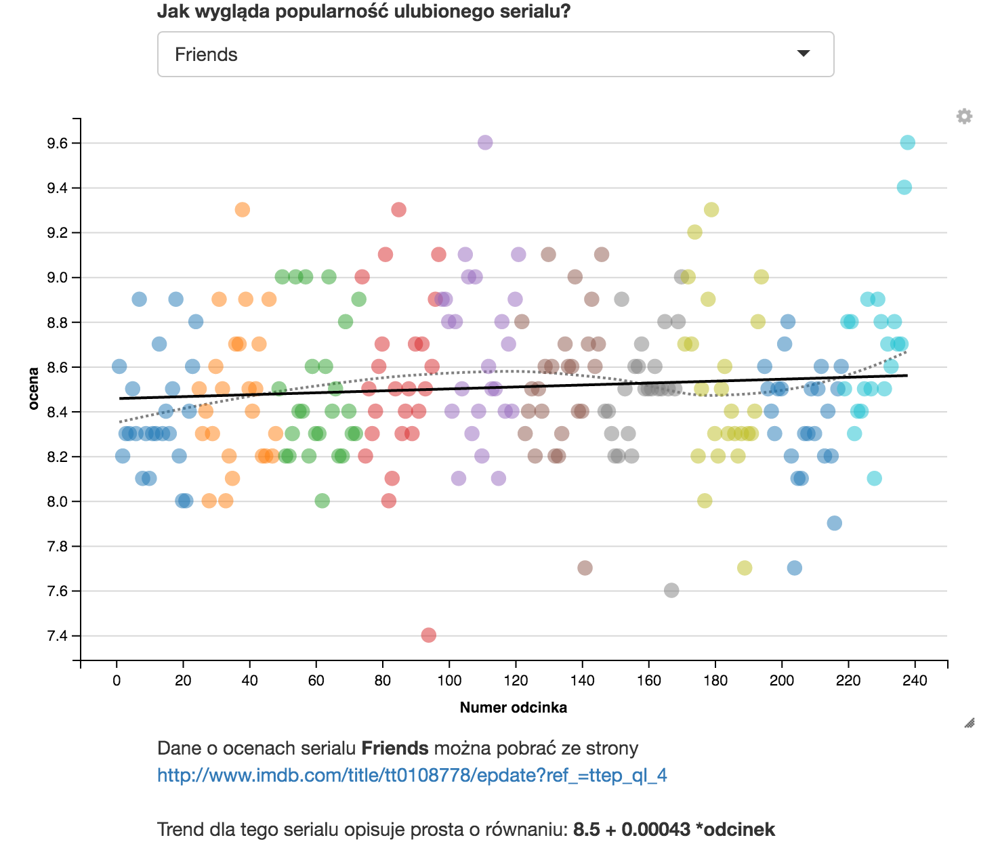

# Jak tworzyć interaktywne aplikacje z pakietem Shiny?

Aplikacje Shiny to strony internetowe tworzone i zasilane przez działającą na serwerze aplikację R. Użytkownicy aplikacji mogą poprzez stronę HTML wybierać parametry przetwarzania, przetwarzanie danych i parametrów ma miejsce na serwerze a jego wynik jest przedstawiany ponownie na stronie internetowej.

Wytłumaczę się dlaczego raz nazwę Shiny piszę z dużej litery a raz z małej. Słowo `shiny` odnosi się do nazwy pakietu i ta nazwa jest z małej litery, ale autorzy tej biblioteki sugerują by pisząc o aplikacjach używać dużej litery aplikacje Shiny.

Galeria interesujących przykładów aplikacji wykonanych z użyciem biblioteki `shiny` znajduje się na stronie http://shiny.rstudio.com/gallery/. 

Poniższe przykłady będą inspirowane aplikacją dostępną na stronie http://mi2.mini.pw.edu.pl:8080/Przewodnik/seriale/. 

Pozwala ona wybrać nazwę serialu i wyświetlić dla wskazanego serialy o popularności kolejnych odcinków i sezonów. Dane przedstawiane na tym wykresie pochodzą ze zbioru danych `serialeIMDB` w pakietu `PogromcyDanych`.

