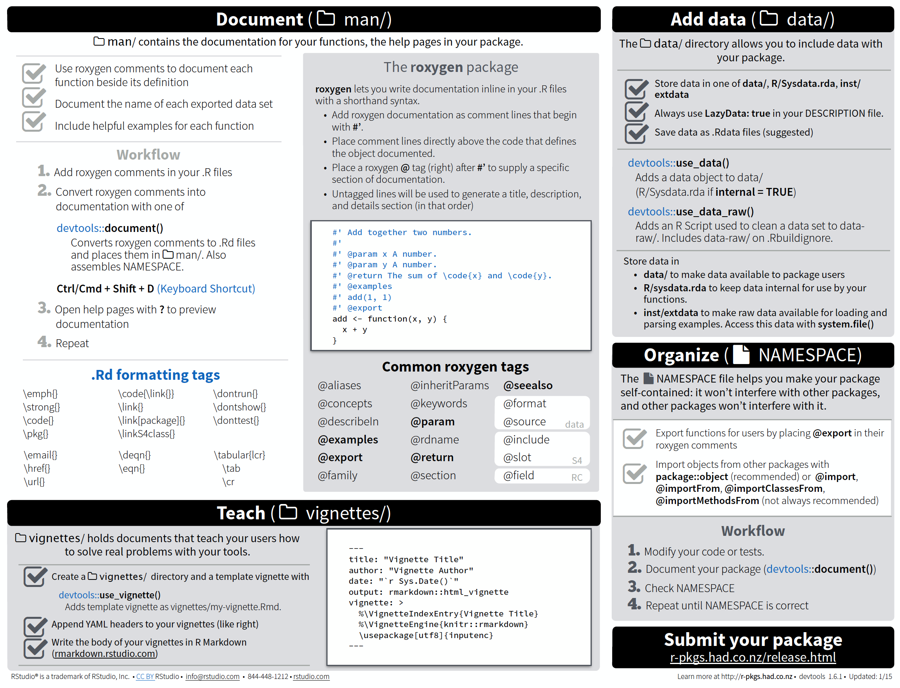
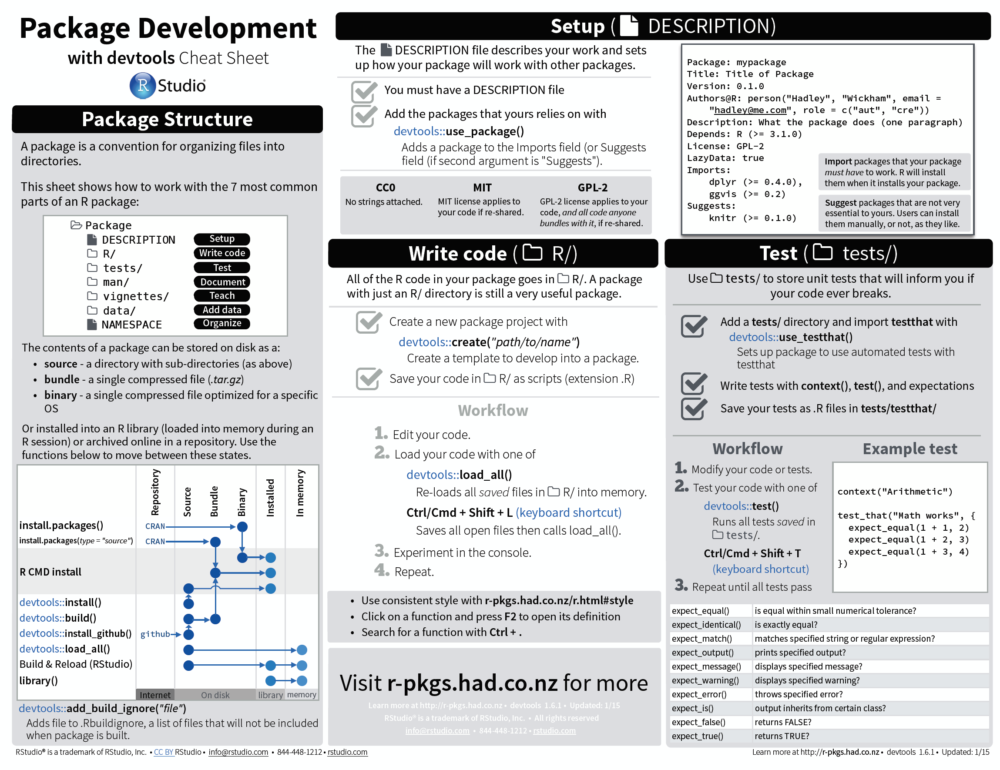

# Inne materiały

Bardzo rozbudowana, niespecjalnie czytelna ale wyczerpująca (z różnymi znaczeniami tego słowa) dokumentacja dotycząca pakietów dostępna jest na stronie ,,R extensions''.
http://cran.r-project.org/doc/manuals/R-exts.html#Creating-R-packages.

Pozycją obowiązkową jest nowa książka Hadleya o tym jak pisać pakiety. Lektura na 3-4 godziny dostępna na stronie http://r-pkgs.had.co.nz/intro.html.

Uzupełnieniem dla obu powyższych jest dokumentacja pakietu `roxygen2` dostępna na stronie projektu https://github.com/klutometis/roxygen#roxygen2.

Więcej o testach i pakiecie testthat przeczytać można w artykule *testthat: Get Started with Testing* Hadley Wickham. ^[https://journal.r-project.org/archive/2011-1/RJournal_2011-1_Wickham.pdf]

Streszczeniem materiału o pakietach jest ściągawka pakietu devtools opracowana przez RStudio dostępna na stronie https://www.rstudio.com/wp-content/uploads/2015/03/devtools-cheatsheet.pdf.
Umieszczam ją poniżej.





## Automatyczne formatowanie kodu

Jeżeli chcemy nasz kod udostępnić innym, to warto zadbać o to by kod jakoś wyglądał.

Jeżeli nie mamy silnie rozwiniętych nawyków dotyczących formatowania kodu, warto skorzystać z automatycznego formatowania dla przygotowanych funkcji.
Interesującym rozwiązaniem jest pakiet `formatR`.

Funkcja `tidy_dir()` z pakietu `formatR` formatuje treść kodu we wszystkich plikach R ze wskazanego katalogu.

```
library("formatR")
tidy_dir("kupPanAuto/R")
```
