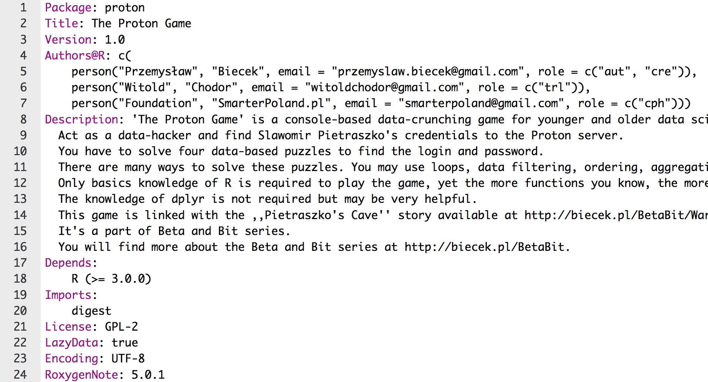

# Jak stworzyć nowy pakiet?

Nowy pakiet najwygodniej budować używając funkcji `create()` z biblioteki `devtools`.

Na potrzeby tego rozdziału stworzymy nowy pakiet `kupPanAuto`. Aby stworzyć pusty pakiet o takiej nazwie potrzebne jest wywołanie.

```
library(devtools)
create("kupPanAuto")
```

Pierwszym argumentem funkcji `check()` jest ścieżka, w której należy stworzyć nowy pakiet. Ostatni element tej ścieżki (tutaj jedyny) to nazwa pakietu. Powyższa instrukcja w aktualnym katalogu stworzy podkatalog o nazwie `kupPanAuto` z minimalną liczbą niezbędnych plików.


## Plik DESCRIPTION

Nowo stworzony pakiet ma generyczny plik `DESCRIPTION`. 
Pierwszą rzeczą, którą należy zrobić po zbudowaniu pakietu to uzupełnienie informacji w tym pliku. 

W sekcji `Package` uzupełniamy nazwę pakietu, w sekcji `Title` jednozdaniowy opis pakietu, w sekcji `Authors` informację o autorach oraz ich roli przy tworzeniu pakietów. W sekcji `Description` uzupełniamy szerszy opis pakietu.

Szczególnie istotne są sekcje `Imports` i `Suggests`, opisują one zależności od innych pakietów. 

* Sekcja `Imports` wskazuje pakiety niezbędne do działania Twojego pakietu. R będzie je instalował przy instalacji Twojego pakietu.
* Sekcja `Suggests` wskazuje pakiety dodatkowe, które mogą rozszerzać możliwości Twojego pakietu, ale nie są niezbędne do działania kluczowych funkcjonalności.





