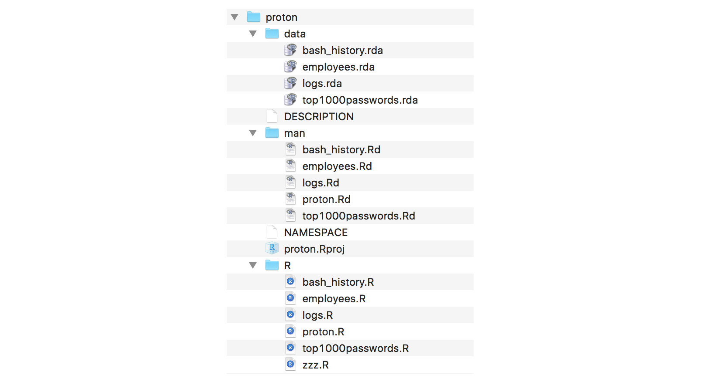

Cytując Hilary Parker: *Seriously, it doesn’t have to be about sharing your code (although that is an added benefit!). It is about saving yourself time.*

Funkcjonalności w programie R są udostępnianie poprzez pakiety. Pakiety mogą zawierać nowe funkcje lub nowe zbiory danych lub jedno i drugie.
Cześć pakietów jest automatycznie łatdowanych przy starcie R (np. *stats*, *graphics*, *base*) a część trzeba włączyć samodzielnie (np. *ggplot2*, *dplyr*, *PogromcyDanych*) a jeszcze inne trzeba najpierw doinstalować.

Po co tworzyć własne pakiety? Motywacje można mieć najróżniejsze, najczęstsze to:

* Chęć udostępnienia opracowanych funkcji lub danych innym osobom. Możemy nowe funckjonalności dodać do pakietu a następnie udostępnić współpracownikom w formie lub upublicznić pakiet dla całago świata.
* Chęć zamknięcia pewnego zbioru funkcjonalności w zwartym kontenerze. Nawet jeżeli będziemy jedynymi użytkownikami pakietu, to warto, ponieważ ułatwi to zarządzanie powiązanymi funkcjonalnościami.
* Potrzeba uporządkowania opracowanych funkcjonalności. Używanie pakietów wymusza jednolitą strukturę.

# Struktura

Pakiet to katalog, wewnątrz którego znajdują się pliki i podkatalogi ze ściśle określoną zawartością:

- plik `DESCRIPTION`, z opisem podstawowych informacji o pakiecie (nazwa, opis, autor, zależności),
- plik `NAMESPACE`, z opisem funkcji udostępnionych przez pakiet,
- katalog `R`, z listą funkcji w programie R,
- katalog `data`, z listą zbiorów danych udostępnionych przez pakiet,
- katalog `man`, z plikami dokumentacji Rd dla udostępnionych funkcji i zbiorów danych,
- katalog `vignettes`, z listą przewodników opisujących funkcjonalności pakietu,
- katalog `tests`, z listą testów weryfikujących poprawność funkcji.

