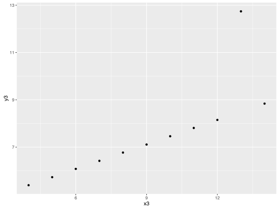
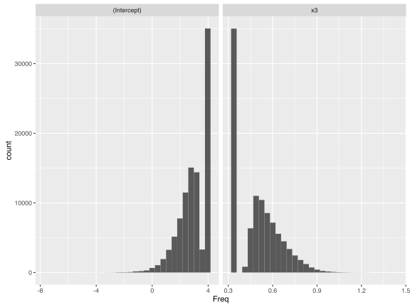

# Jak zrównoleglić obliczenia w R? 

Jeżeli mamy do wykonania obliczenia (np. symulacje), które trwałyby 10 dni, to mamy do wyboru trzy możliwości:

* poczekać 10 dni, w sumie to nie tak długo. Choć co jeżeli to 10 lat a nie  10 dni?
* poszukać szybszego komputera, jeżeli nasz nie jest najszybszy to może znajdziemy jakiś 2-3 razy szybszy. A może nawet 5 razy szybszy, dzięki czemu z 10 lat zrobią się *tyko* dwa lata.
* Zrównoleglić kod i uruchomić go na 10 000 rdzeni. Jeżeli obliczenia można łatwo zrównoleglić, to z 10 lat zrobi się 8 godzin obliczeń.

Jak widzimy, w rzeczywistości nie mamy żadnego wyboru. Pozostaje więc pytanie, jak zrównoleglić obliczenia w R?

## Zrównoleglenie jawne / ukryte

Lista narzędzi do przyśpieszania i zrównoleglania obliczeń znajduje się na stronie https://cran.r-project.org/web/views/HighPerformanceComputing.html.

Narzędzia do zrównoleglania obliczeń podzielone są na dwie grupy: *Explicit parallelism* i *Implicit parallelism*. Pierwsze to narzędzia pozwalające na (większą lub mniejszą) kontrolę procesu tworzenia klastra obliczeniowego i zrównoleglania obliczeń. Drugie ukrywają proces zrównoleglania, tak że końcowy użytkownik może nawet tego zrównoleglenia nie być świadomy. Może zajmować się tym kompilator, sprzęt lub jakaś zewnętrzna biblioteka.

Jeżeli korzystamy z dobrych bibliotek R, które są wymagające obliczeniowo (np. `caret` gdzie jest wiele metod z boostingiem), to jest możliwe, że te biblioteki we własnym zakresie zrównoleglają obliczenia.

Poniżej zajmiemy się tylko pakietami do jawnego zrównoleglania kodu.

## Ach ten Windows

Pakiety programu R pozwalające na zrównoleglanie obliczeń można z grubsza podzielić na dwie grupy:

* Te, które działają na każdym popularnym systemie operacyjnym,
* Te, które działają na każdym popularnym systemie operacyjnym poza Windows.

Ta druga grupa jest liczniejsza. Poniżej postaram się opisać rozwiązania zarówno z pierwszej jak i drugiej grupy.


# Biblioteka parallel

W programie R powstało wiele rozwiązań do przetwarzania równoległego. Z biegiem czasu, rozwiązania z dobrych i rozwiniętych pakietów takich jak `snow` i `multicore` trafiły do biblioteki `parallel`. I to tę bibliotekę omówimy poniżej.

## Rodzaje klastrów

Przetwarzanie równoległe przebiega zazwyczaj w następującej sekwencji kroków.

1. Zbuduj klaster - zainicjuj proces R na różnych węzłach/procesorach/rdzeniach.
2. Wyślij dane/kod z węzła głównego na pozostałe węzły.
3. Wykonuj kod równolegle, z lub bez komunikacji pomiędzy węzłami (najlepiej bez komunikacji).
4. Zbierz wyniki z roboczych węzłów.
5. Zwiń klaster, zwolnij zasoby.

To w jaki sposób zadania są przetwarzane i jak zbierane są wyniki zależy od typu klastra. Różnych typów jest wiele, ale wyróżnijmy trzy.

* *PSOCK (Parallel Socket Cluster)*, klaster oparty o gniazda. Można go budować na każdym systemie operacyjnym, też na systemie Windows. Tworząc klaster inicjujemy nowe procesy R poleceniem `Rscript`. Procesy są normalnie inicjowane, będą więc miały pustą przestrzeń nazw. Wszystkie zmienne trzeba im przesłać osobno po zainicjowaniu. 
* FORK, klaster oparty o systemy Unixowe (czyli też OSX), w których procesy mogą się forkować, czyli tworzyć (szybko) swoje kopie. Forkowanie ma zalety (szybki start, procesy startują z dostępnymi wszystkimi zmiennymi, które były w procesie nadrzędnym). Wadą jest w sumie jedynie to, że nie działają na Windowsie.
* MPI, klaster oparty o protokół komunikacji MPI, *Message Passing Interface*. Zaletą jest to, że procesy mogą się komunikować w trakcie działania.

Poniżej omówimy zastosowania funkcji `parLapply()` mogącej pracować z klastrami PSOC, FORK i innymi oraz funkcji `mclapply()`, pracującej tylko z klastrami FORK, ale będącej idealnym zastępstwem dla funkcji `lapply()`.


## Funkcja parLapply()

Nawet jeżeli pracujemy na małym komputerze, wciąż możemy wykorzystać wszystkie rdzenie, które w nim mamy. Wygodnie jest do tego wykorzystać bibliotekę `parallel`. 

Funkcją `detectCores()` sprawdźmy na początek ile mamy rdzeni w komputerze.

```r
library(parallel)
detectCores()
```

```
[1] 8
```

Na tym małym laptopie mamy tylko 8 rdzeni. Aby sensownie na nim pracować zajmiemy 7 rdzeni pozostawiając jeden na inne zadania.

Klaster można zbudować funkcją `makeCluster()`. Domyślnie tworzony jest klaster typu PSOC. Specyfikacja tego klastra (pierwszy argument) to  liczba węzłów, które mają być stworzone. 

```r
N <- 100000

klaster <- makeCluster(detectCores()-1)
print(klaster)
```

```
socket cluster with 7 nodes on host 'localhost'
```

Mamy klaster, czas na nim coś ciekawego policzyć.

Stwórzmy funkcję `alm()`, która dla każdego wywołania, zbuduje próbę boostrapową ze zbioru `anscombe` i wyznaczy na niej współczynniki dla modelu `y3~x3`. 

Następnie użyjemy funkcji `parLapply()` aby powtórzyć tę operację 100 000 razy. 


```r
alm <- function(i) {
  tmp <- anscombe[sample(nrow(anscombe), replace = T),]
  lm(y3~x3, data=tmp)$coef
}

system.time({
  res <- parLapply(klaster, 1:N, alm)
})
```

```
   user  system elapsed 
  0.158   0.060  27.972 
```

Wynikiem funkcji `parLapply()` jest lista z wynikami poszczególnych wywołań funkcji `alm()`. 

W powyższym przykładzie funkcja `alm()` przyjmuje jeden argument (ponieważ musi) ale z niego nie korzysta (ponieważ nie potrzebuje). Każda próba boostrapowa jest wyznaczana niezależnie.

Przekształćmy tę listę z wynikami do ramki danych. Używając biblioteki `ggplot2` pokażemy najpierw dane ze zbioru `anscombe` na których będziemy pracować, a następnie rozkład współczynników wyznaczony metodą bootstrap w modelu regresji.

```r
wspolczynniki <- as.data.frame(as.table(simplify2array(res)))

library(ggplot2)
ggplot(anscombe, aes(x3, y3)) +
  geom_point()
```



```r
ggplot(wspolczynniki, aes(Freq)) + 
  geom_histogram() + facet_wrap(~Var1, scales = "free_x")
```



Funkcja `alm()` nie potrzebowała żadnych argumentów. Ale są funkcje, które potrzebują. Jak je przekazać?

Wszystkie dodatkowe argumenty można przekazać wewnątrz funkcji `parLapply()`. W poniższym przykładzie zbiór danych przesyłamy za pomocą argumentu `new_data`.


```r
alm <- function(i, new_data) {
  tmp <- new_data[sample(nrow(new_data), replace = T),]
  lm(y3~x3, data=tmp)$coef
}

system.time({
  res <- parLapply(klaster, 1:N, alm, new_data = anscombe)
})
```

```
Error in summary.connection(connection): invalid connection
```

Timing stopped at: 0.021 0 0.02 

```
   user  system elapsed 
  0.171   0.072  32.649 
```

Przekazywanie danych przez argumenty funkcji to spory narzut. Czasem wygodniej byłoby przekazać dane lub parametry w inny sposób. 
Można do tego celu wykorzystać funkcje `clusterExport()`.

Wskazaną zmienną wysyła do wszystkich węzłów klastra. W poniższym przykładzie, funkcja `alm()` korzysta ze zmiennej `new_data`, która została wcześniej rozesłana po węzłach klastra za pomocą funkcji `clusterExport()`.

```r
new_data <- anscombe
clusterExport(klaster, "new_data")

alm <- function(i) {
  tmp <- new_data[sample(nrow(new_data), replace = T),]
  lm(y3~x3, data=tmp)$coef
}

system.time({
  res <- parLapply(klaster, 1:N, alm)
})
```

```
   user  system elapsed 
  0.189   0.071  32.358 
```

Funkcja `parLapply()` jako wynik zwraca listę wartości. Listę tę można uprościć czasem do wektora czasem do macierzy używając funkcji `simplify2array()`. Aby nie kłopotać się tym dodatkowym wywołaniem, można zamiast `parLapply()` użyć `parSapply()`.

```r
res <- parSapply(klaster, 1:N, alm)
str(res)
```

```
 num [1:2, 1:100000] 4.008 0.345 2.231 0.607 2.651 ...
 - attr(*, "dimnames")=List of 2
  ..$ : chr [1:2] "(Intercept)" "x3"
  ..$ : NULL
```

Po zakończeniu obliczeń równoległych należy pozamykać wiszące i zużywające RAM procesy. Aby zwinąć klaster można wykorzystać funkcję `stopCluster()`.

```r
stopCluster(klaster)
```

## Funkcja mclapply

Jeżeli pracujemy na systemie Unix to możemy skorzystać z klastrów typu FORK. O nie oparta jest funkcja `mclapply()`, która tworzy kopie procesu R, kopia ma zainicjowane wszystkie zmienne. Na tych kopiach wykonywane są równolegle obliczenia a ich wyniki są na końcu zwijane do wyjściowego procesu.

Funkcja `mclapply()` wykorzystuje domyślnie liczbę rdzeni zdefiniowaną w opcji `mc.cores`. Sama inicjuje klaster, wykonuje obliczenia i zwija klaster.

Można ją stosować zamiennie z funkcją `lapply()`.

```r
alm <- function(i) {
  tmp <- new_data[sample(nrow(new_data), replace = T),]
  lm(y3~x3, data=tmp)$coef
}
```

```
[1] 8
```

```r
getOption("mc.cores", 2)
system.time({
  res <- mclapply(1:N, alm)
})
```

```
   user  system elapsed 
187.179   6.089  40.159 
```

```r
str(simplify2array(res))
```

```
 num [1:2, 1:100000] 3.096 0.517 2.036 0.7 2.316 ...
 - attr(*, "dimnames")=List of 2
  ..$ : chr [1:2] "(Intercept)" "x3"
  ..$ : NULL
```

# Zadania

* Wybierz funkcję, która krótko się liczy (np. model liniowy na 11 wierszach). Wykonaj ją tysiące razy i zobacz jak wygląda czas obliczeń jako funkcja liczby użytych rdzeni.
* Wybierz funkcję, która długo się liczy (np. model liniowy na tysiącach kolumn). Wykonaj ją kilkadziesiąt razy i zobacz jak wygląda czas obliczeń jako funkcja liczby użytych rdzeni.


