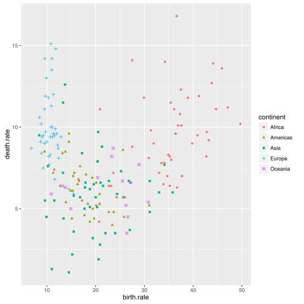
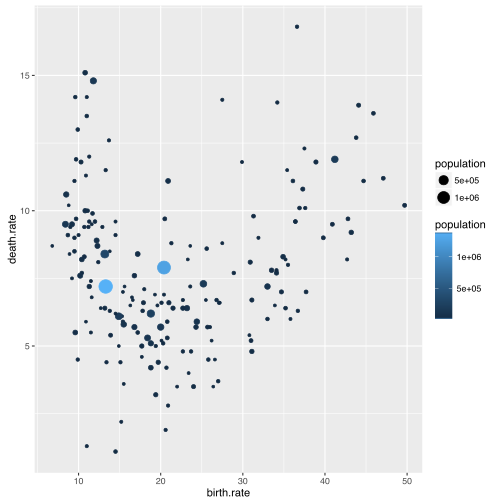

## Jak określać mapowania?

Wykresy przedstawiają kolekcje obiektów, które są opisane przez atrybuty graficzne. Mapowania określają, które atrybuty wykresów kodują które zmienne ze zbioru z danymi.

Mapowania są opisane wewnątrz funkcji `aes()` (od *aesthetic*). Są to pary postaci *atrybut graficzny* = *nazwa zmiennej*.

Dla każdego typu geometrii (warstwy wykresu) określone jest, jakie atrybuty graficzne mogą przedstawiać dane. Lista atrybutów, które można wykorzystać dla geometrii `geom_point` znajduje się pod adresem http://docs.ggplot2.org/current/geom_point.html. W tym przypadku obowiązkowe atrybuty to `x` i `y` - współrzędne punktów. Na poniższym wykresie określamy mapowania również dla atrybutu kolor (`color`) i kształt (`shape`). 


```r
library(ggplot2)
library(SmarterPoland)

ggplot(countries, aes(x=birth.rate, y=death.rate, color=continent, shape=continent)) +
  geom_point()
```



W tym przykładzie, określając mapowanie *kształt* = *kontynent* żądamy by kształty punktów odpowiadały kontynentom. Nie określamy jednak jaki kształt ma określać który kontynent.  

Sposób mapowania wybiera biblioteka `ggplot2` na podstawie typu zmiennej (factor/ilościowa/logiczna) i liczby poziomów, które mają być przedstawione.

Przykładowo, na poprzednim wykresie przedstawialiśmy kontynent za pomocą kolorów. Kolory są tak dobierane by możliwie ułatwić rozróżnienie poszczególnych kontynentów. Nie ma jednak żadnego założonego porządku pomiędzy kontynentami.

Na poniższym przykładzie kolor mapujemy na zmienną ilościową - populacja. Tutaj jest już porządek i jest on odzwierciedlony przez skalę kolorów rozpinającą się od niebieskiego po czerń.


```r
ggplot(countries, aes(x=birth.rate, y=death.rate, color=population, size=population)) +
  geom_point()
```



