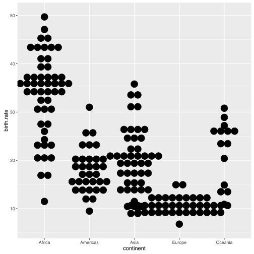
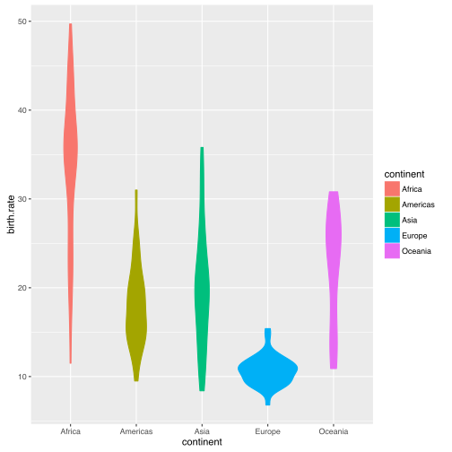
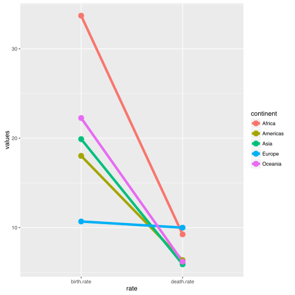

# Jak określać geometrię?

Geometria określa kolekcje kształtów, które prezentują dane.
Mogą to być punkty (patrz `geom_point()`), linie, prostokąty, obszary, praktycznie dowolne kształty.

Lista dostępnych obecnie geometrii dostępna jest na stronie  http://docs.ggplot2.org/current/. Pakiet `ggplot2` ma również mechanizmy pozwalające na tworzenie dowolnych nowych geometrii, np. [przedstawianie danych za pomocą małych choinek](http://smarterpoland.pl/index.php/2015/12/geom_christmas_tree-a-new-geom-for-ggplot2-v2-0/).

Poniżej przedstawiamy przykłady geometrii `geom_dotplot` (ułożone na sobie punkty), `geom_violin` (skrzypce), `geom_line` (linie).


```r
library(ggplot2)
library(SmarterPoland)

ggplot(countries, aes(x = continent, y = birth.rate)) +
  geom_dotplot(binaxis = "y", stackdir = "center")
```



```r
ggplot(countries, aes(x = continent, y = birth.rate, color=continent, fill=continent)) +
  geom_violin()
```



```r
library(tidyr)
countries %>% 
  gather(rate, values, birth.rate, death.rate) %>%
  group_by(continent, rate) %>%
  summarise(values = mean(values, na.rm=TRUE)) %>%
  ggplot(aes(x = rate, y = values, group=continent, color=continent)) +
  geom_line(size=2) +
  geom_point(size=4) 
```


