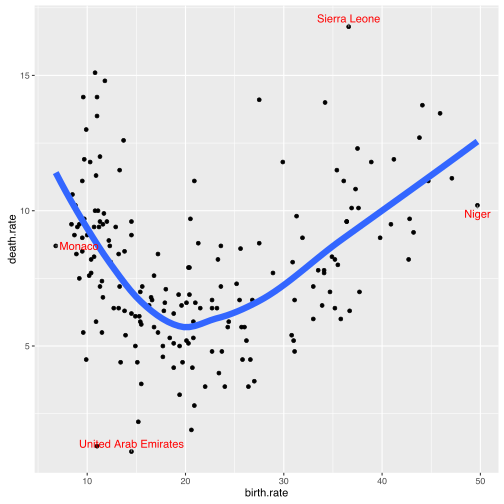

# Jak składać wykres z kilku warstw?

Tworzenie złożonych i bogatych w treść grafik jest w `ggplot2` możliwe dzięki składaniu warstw. 
Wszystkie warstwy istnieją we wspólnych ramach układu współrzędnych wykresu, przez to można łatwiej porównywać obiekty pomiędzy warstwami 
Daje to duże możliwości budowy wielowarstwowych grafik o uzupełniających się treściach.

Dodanie kolejnej warstwy odbywa się przez dodanie operatorem `+` kolejnej geometrii.
Poniżej znajduje się przykład wykresu z trzema warstwami. Są to kolejno warstwa z punktami, krzywą trendu i nazwami wybranych krajów.

Warstwy te uzupełniają się. W głównym planie jest linia z trendem, punkty pełnią rolę uzupełniającą na drugim planie. Napisami zaznaczono najbardziej skrajne kraje.


```r
library(ggplot2)
library(ggrepel)
library(SmarterPoland)

ggplot(countries, aes(x=birth.rate, y=death.rate, label=country)) +
  geom_point() + 
  geom_smooth(se=FALSE, size=3) + 
  geom_text_repel(data=countries[c(108,120,176,148),], color="red")
```


