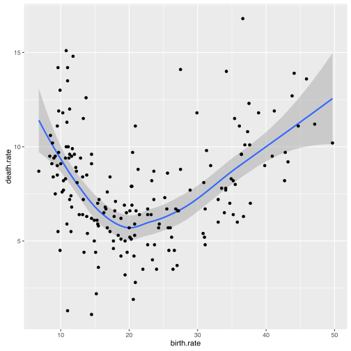
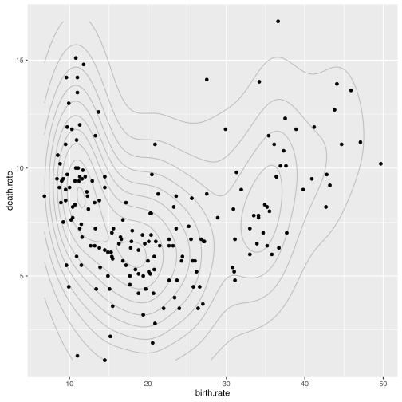
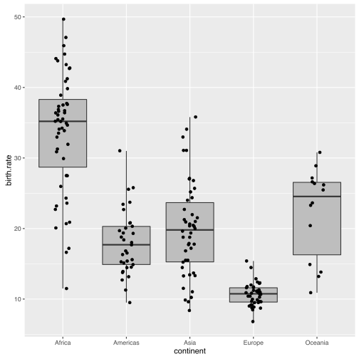
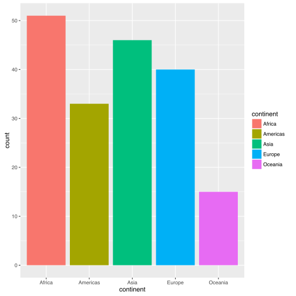

# Jak określać statystyki?

Zazwyczaj pracujemy z danymi tabelarycznymi, ze zmiennymi w kolumnach i obserwacjami w wierszach.

Nie zawsze jednak chcemy by każdy wiersz był przedstawiony na wykresie. W określonych sytuacjach zamiast przedstawiać wiersze osobno, lepiej jest wyliczyć na nich jakąś statystykę i to ją przedstawić na wykresie.

Taka statystyka może scharakteryzować zależność w danych i być dobrym uzupełnieniem prezentacji poszczególnych punktów.

Warstwy ze statystykami można tworzyć używając funkcji `stat_` (ich lista jest tutaj http://docs.ggplot2.org/current/) lub funkcji `geom_` w których określi się argument `stat`.

Statystyki można parametryzować. Przykładowo, statystyka `stat_smooth()` ma argument `method` pozwalający na określenie w jaki sposób ma być wyznaczany trend w danych, statystyka `stat_density2d()` pozwala na określenie parametrów gęstości jądrowej, w tym szerokości okna.

Poniżej przedstawiamy cztery wybrane statystyki. Każda z nich tworzy osobną warstwę na wykresie.


```r
library(ggplot2)
library(SmarterPoland)

ggplot(countries, aes(x = birth.rate, y = death.rate)) +
  stat_smooth() + geom_point()
```



```r
ggplot(countries, aes(x=birth.rate, y=death.rate)) +
  stat_density2d(h=c(10,10), color="grey")  + geom_point()
```



```r
ggplot(countries, aes(x = continent, y = birth.rate)) +
  stat_boxplot(fill="grey", coef = 3) + geom_jitter(width = 0.3)
```



```r
ggplot(countries, aes(x=continent, fill=continent)) +
  geom_bar() 
```


