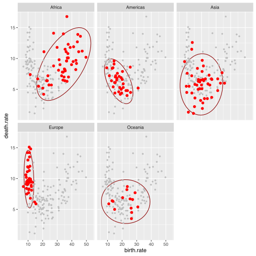
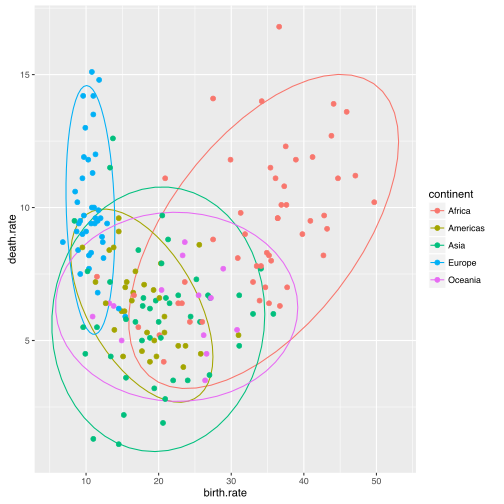

# Jak tworzyć panele?

Jedną z ciekawych możliwości pakietu `ggplot2` jest przedstawianie wyników dotyczących podgrup danych na sąsiednich panelach.

Panele mają taki sam układ współrzędnych, przez co łatwiej jest porównywać zależności pomiędzy nimi.

Panele tworzy się funkcją `facet_grid()` lub `facet_wrap()`. Poniżej przedstawiamy przykład w którym każdy panel przedstawia inny kontynent, ale też do każdego panelu dodano w tle punkty przedstawiające wszystkie dane. Ułatwia to orientacje jak dla różnych kontynentów wyglądają współczynniki narodzin i zgonów na tle pozostałych krajów.

Grupy można wyróżniać też kolorami korzystając z tylko jednego panelu (drugi przykład poniżej). Ale taki wykres jest czytelny tylko, jeżeli grup jest niewiele. Dla dużej liczby grup panele są zdecydowanie lepszym rozwiązaniem.


```r
library(ggplot2)
library(SmarterPoland)

ggplot(na.omit(countries), aes(x = birth.rate, y = death.rate)) +
  stat_ellipse(color="red4")+
  geom_point(data=countries[,-5],size=1,color="grey") +
  geom_point(size=2, color="red") + 
  facet_wrap(~continent)
```



```r
ggplot(na.omit(countries), aes(x = birth.rate, y = death.rate, color=continent)) +
  stat_ellipse()+
  geom_point(size=2)
```


