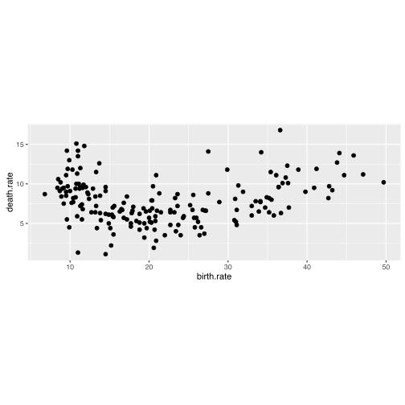
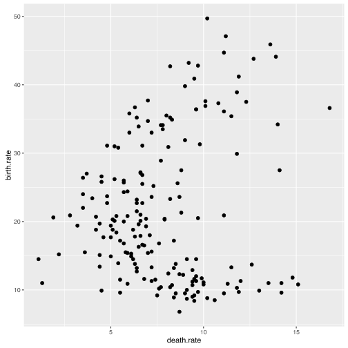

# Jak modyfikować układ współrzędnych?

Na wykresach dane są prezentowane w układzie współrzędnych. 
Układ jest ramą dla całego wykresu, domyślnie jest to rama kartezjańska.

Są jednak sytuacje, w których możemy chcieć tę ramę zmienić. Jeżeli przedstawiamy mapy to możemy chcieć wykorzystać inną projekcję. Możemy chcieć zamienić osie miejscami. Lub spowodować, że jedna z osi jest logarytmiczna lub pierwiastkowa. 
Jeżeli na osiach prezentowana jest ta sama jednostka to możemy zażyczyć sobie by zachowane były proporcje pomiędzy osią pionową a poziomą.

Wszystkie te rzeczy są możliwe przy odpowiednim określeniu układu współrzędnych.

Dla pakietu `ggplot` układ współrzędnych można określić funkcją `coord_`. Dla jednego wykresu określić można tyko jeden układ współrzędnych.


```r
library(ggplot2)
library(SmarterPoland)

pl <- ggplot(na.omit(countries), aes(x = birth.rate, y = death.rate)) +
  geom_point(size=2, color="black") 

pl + coord_fixed()
```



```r
pl + coord_flip()
```


