# Jak tworzyć wykresy z pakietem ggplot2?

Pakiet `ggplot2` jest jednym z najbardziej zaawansowanych narzędzi do tworzenia wykresów statystycznych. Zaawansowanie nie oznacza, że można szybko zrobić w nim wykres, ani też, że dostępnych jest wiele szablonów wykresów. Oznacza, że konstrukcja pakietu jest na tyle elastyczna, że można z nim wykonać praktycznie każdą grafikę statystyczną.

Tę elastyczność uzyskuje się opierając strukturę wykresu na sposobie w jaki myślimy i czytamy wykresy. Patrząc na wykres nie widzimy w nim zbioru odcinków i kółek, ale kolekcje obiektów na swój sposób podobnych lub różnych. Tworząc wykres nie powinniśmy więc myśleć o tym gdzie i jak narysować odcinek, ale o tym jak elementy wykresu mają reprezentować dane.

Gramatyka grafiki jest szerzej opisana [w tym eseju](http://biecek.pl/Eseje/indexGramatyka.html).

Poniższe przykłady oparte są o zbiór danych `countries` ze współczynnikami dzietności / umieralności dla różnych krajów.


```r
library(SmarterPoland)
head(countries)
```

```
##               country birth.rate death.rate population continent
## 1         Afghanistan       34.1        7.7      30552      Asia
## 2             Albania       12.9        9.4       3173    Europe
## 3             Algeria       24.3        5.7      39208    Africa
## 4             Andorra        8.9        8.4         79    Europe
## 5              Angola       44.1       13.9      21472    Africa
## 6 Antigua and Barbuda       16.5        6.8         90  Americas
```

## Jak zrobić pierwszy wykres?

Minimalna definicja wykresu w pakiecie `ggplot2` składa się przynajmniej z trzech elementów. 

* Funkcja `ggplot()` tworzy zrąb wykresu. W tym miejscu deklaruje się parametry wspólne dla pozostałych elementów wykresu. Deklaracja może być pusta, ale zazwyczaj wskazuje się tutaj zbiór danych (poniżej `countries`) i mapowania (poniżej funkcja `aes()`).
* Funkcje `geom_`/`stat_` tworzą kolejne warstwy prezentacji danych, nazywane dalej geometriami. Poniżej wykorzystywana jest funkcja `geom_point()` tworząca warstwę z punktami. 
* Operator `+` łączy opisy kolejnych elementów wykresu.

Zbudujmy wykres, przedstawiający za pomocą punktów informacje o częstości narodzin i zgonów dla różnych krajów.


```r
library(ggplot2)

ggplot(countries, aes(x=birth.rate, y=death.rate)) + geom_point()
```

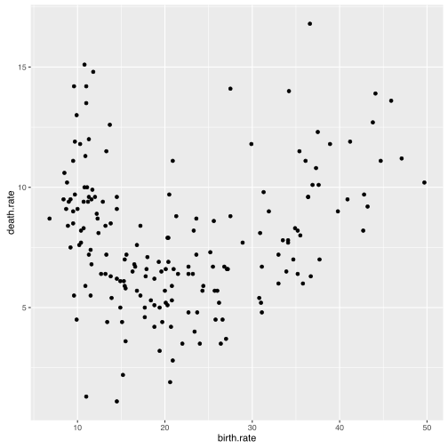

Gramatyka zaimplementowana w pakiecie `ggplot2` pozwala na budowę wykresów o strukturze przedstawionej na poniższej grafice. 
Składa się na z wielu elementów.
Omówimy je jeden po drugim.


## Jak określać mapowania?

Wykresy przedstawiają kolekcje obiektów, które są opisane przez atrybuty graficzne. Mapowania określają, które atrybuty wykresów kodują któ®e zmienne ze zbioru z danymi.

Mapowania są opisane wewnątrz funkcji `aes()` (od *aesthetic*). Są to pary postaci *atrybut graficzny* = *nazwa zmiennej*.

Dla każdego typu geometrii (warstwy wykresu) określone jest, jakie atrybuty graficzne mogą przedstawiać dane. Lista aktrybutów, któ®e można wykorzystać dla geometrii `geom_point` znajduje się pod adresem http://docs.ggplot2.org/current/geom_point.html. W tym przypadku obowiązkowe atrybuty to `x` i `y` - współrzędne punktów. Na poniższym wykresie określamy mapowania również dla atrybutu kolor (`color`) i kształt (`shape`). 


```r
ggplot(countries, aes(x=birth.rate, y=death.rate, color=continent, shape=continent)) +
  geom_point()
```

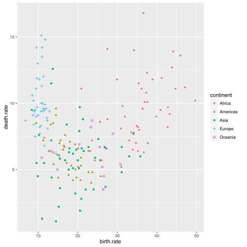

W tym przykłądzie, określając mapowanie *kształt* = *kontynent* żądamy by kształty punktów odpowiadały kontynentom. Nie określamy jednak jaki kształt ma określać który kontynent.  

Sposób mapowania wybiera biblioteka `gglot2` na podstawie typu zmiennej i liczby poziomów, które mają być przedstawione.

Przykładowo, na poprzednim wykresie przedstawialiśmy kontynent za pomocą kolorów. Kolory są tak dobierane by możliwie ułatwić rozróżnienie poszczególnych kontynentów. Nie ma jednak żadnego założonego porządku pomiędzy kontynentami.

Na poniższym przykładzie kolor mapujemy na zmienną ilościową - populacja. Tutaj jest już porządek i jest on odzwierciedlony przez skalę kolorów rozpinającą się od niebieskiego po czerń.


```r
ggplot(countries, aes(x=birth.rate, y=death.rate, color=population, size=population)) +
  geom_point()
```

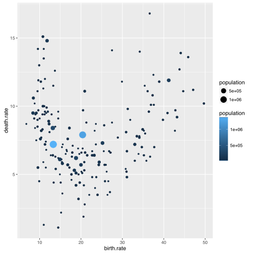

## Jak określać geometrię?

Geometria określa kolekcje kształtów, które prezentują dane.
Mogą to być punkty (patrz `geom_point()`), linie, prostokąty, obszary, praktycznie dowolne kształty.

Lista dostępnych obecnie geometrii dostępna jest na stronie  http://docs.ggplot2.org/current/. Pakiet `ggplot2` ma również mechanizmy pozwalające na tworzenie dowolnych nowych geometrii, np. [przedstawianie danych za pomocą małych choinek](http://smarterpoland.pl/index.php/2015/12/geom_christmas_tree-a-new-geom-for-ggplot2-v2-0/).

Poniżej przedstawiamy przykłady geometrii `geom_dotplot` (ułożone na sobie punkty), `geom_violin` (skrzypce), `geom_line` (linie).


```r
ggplot(countries, aes(x = continent, y = birth.rate)) +
  geom_dotplot(binaxis = "y", stackdir = "center")
```

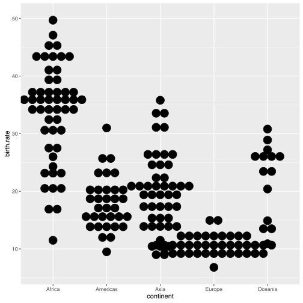

```r
ggplot(countries, aes(x = continent, y = birth.rate, color=continent, fill=continent)) +
  geom_violin()
```

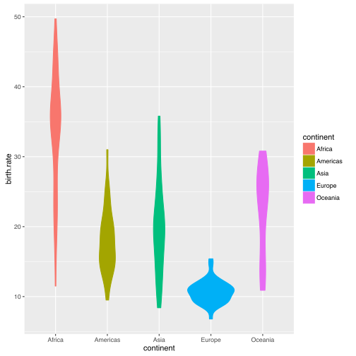

```r
library(tidyr)
countries %>% 
  gather(rate, values, birth.rate, death.rate) %>%
  group_by(continent, rate) %>%
  summarise(values = mean(values, na.rm=TRUE)) %>%
  ggplot(aes(x = rate, y = values, group=continent, color=continent)) +
  geom_line(size=2) +
  geom_point(size=4) 
```

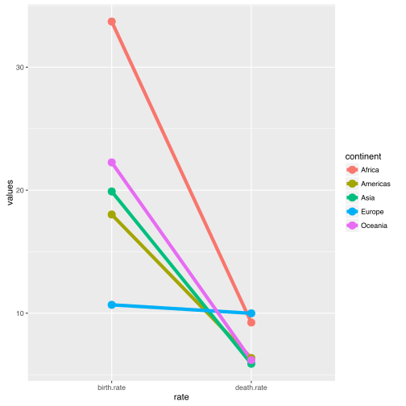

## Jak składać wykres z kilku warstw?

Tworzenie złożonych i bogatych w treść grafik jest w `ggplot2` możliwe dzięki składaniu warstw. 
Wszystkie warstwy istnieją we wspólnych ramach układu współrzędnych wykresu, przez to można łatwiej porównywać obiekty pomiędzy warstwami 
Daje to duże możliwości budowy wielowarstwowych grafik o uzupełniających się treściach.

Dodanie kolejnej warstwy odbywa się przez dodanie operatorem `+` kolejnej geometrii.
Poniżej znajduje się przykład wykresu z trzema warstwami. Są to kolejno warstwa z punktami, krzywą trendu i nazwami wybranych krajów.

Warstwy te uzupełniają się. W głównym planie jest linia z trendem, punkty pełnią rolę uzupełniającą na drugim planie. Napisami zaznaczono najbardziej skrajne kraje.


```r
library(ggrepel)
ggplot(countries, aes(x=birth.rate, y=death.rate, label=country)) +
  geom_point() + 
  geom_smooth(se=FALSE, size=3) + 
  geom_text_repel(data=countries[c(108,120,176,148),], color="red")
```

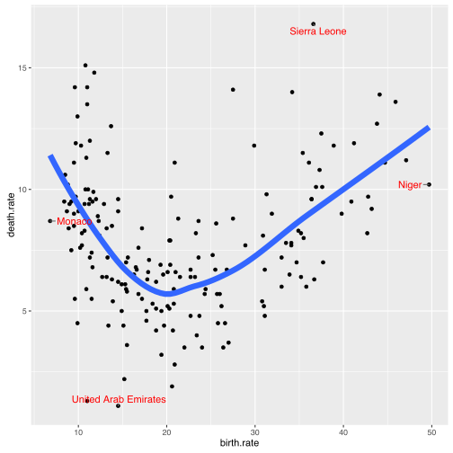

## Jak określać statystyki?

Zazwyczaj pracujemy z danymi tabelarycznymi, ze zmiennymi w kolumnach i obserwacjami w wierszach.

Nie zawsze jednak chcemy by każdy wiersz był przedstawiony na wykresie. W określonych sytuacjach zamiast przedstawiać wiersze osobno, lepiej jest wyliczyć na nich jakąś statystykę i to ją przedstawić na wykresie.

Taka statystyka może scharakteryzować zależność w danych i być dobrym uzupełnieniem prezentacji poszczególnych punktów.

Warstwy ze statystykami można tworzyć używając funkcji `stat_` (ich lista jest tutaj http://docs.ggplot2.org/current/) lub funkcji `geom_` w których określi się argument `stat`.

Statystyki można parametryzować. Przykładowo, statystyka `stat_smooth()` ma argument `method` pozwalający na określenie w jaki sposób ma być wyznaczany trend w danych, statystyka `stat_density2d()` pozwala na określenie parametrów gęstości jądrowej, w tym szerokości okna.

Poniżej przedstawiamy cztery wybrane statystyki. Każda z nich tworzy osobną warstwę na wykresie.


```r
ggplot(countries, aes(x = birth.rate, y = death.rate)) +
  stat_smooth() + geom_point()
```

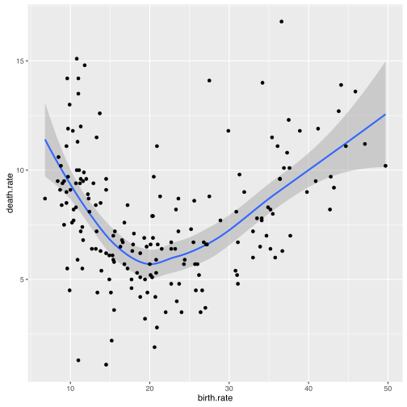

```r
ggplot(countries, aes(x=birth.rate, y=death.rate)) +
  stat_density2d(h=c(10,10), color="grey")  + geom_point()
```

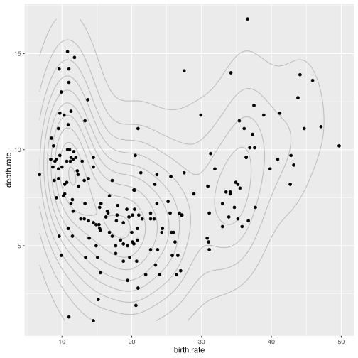

```r
ggplot(countries, aes(x = continent, y = birth.rate)) +
  stat_boxplot(fill="grey", coef = 3) + geom_jitter(width = 0.3)
```

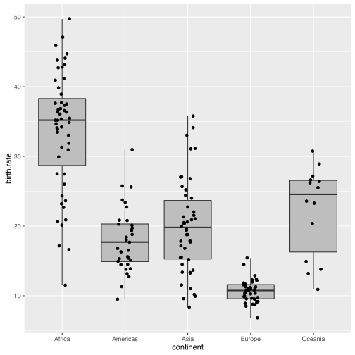

```r
ggplot(countries, aes(x=continent, fill=continent)) +
  geom_bar() 
```

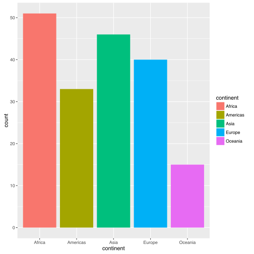

## Jak tworzyć panele?

Jedną z ciekawych możliwości pakietu `ggplot2` jest przedstawianie wyników dotyczących podgrup danych na sąsiednich panelach.

Panele mają taki sam układ współrzędnych, przez co łatwiej jest porównywać zależności pomiędzy nimi.

Panele tworzy się funkcją `facet_grid()` lub `facet_wrap()`. Poniżej przedstawiamy przykład w którym każdy panel przedstawia inny kontynent, ale też do każdego panelu dodano w tle punkty przedstawiające wszystkie dane. Ułatwia to orientacje jak dla różnych kontynentów wyglądają współczynniki narodzin i zgonów na tle pozostałych krajów.

Grupy można wyróżniać też kolorami korzystając z tylko jednego panelu (drugi przykład poniżej). Ale taki wykres jest czytelny tylko, jeżeli grup jest niewiele. Dla dużej liczby grup panele są zdecydowanie lepszym rozwiązaniem.


```r
ggplot(na.omit(countries), aes(x = birth.rate, y = death.rate)) +
  stat_ellipse(color="red4")+
  geom_point(data=countries[,-5],size=1,color="grey") +
  geom_point(size=2, color="red") + 
  facet_wrap(~continent)
```


```r
ggplot(na.omit(countries), aes(x = birth.rate, y = death.rate, color=continent)) +
  stat_ellipse()+
  geom_point(size=2)
```

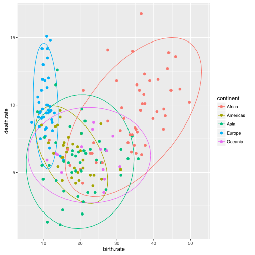

## Jak modyfikować skale?

Opisując mechanizm mapowania napisaliśmy, że wystarczy określić jaka zmienna ma być zamapowana na jaki atrybut i pakiet `ggplot2` już będzie wiedział jak dobrać kolory / kształty.

Co jednak zrobić jeżeli nie podoba nam się zaproponowana skala kolorów / kształtów? Rozwiązaniem może być nadpisanie skali dla mapowania.

Funkcje z klasy `sale_atrybut_wartosc` pozwalają na określenie jak ma wyglądać mapowanie na określony atrybut. Możemy ręcznie wskazać kształty / koloru lub możemy wskazać funkcję, która za nas wyznaczy kolory / kształty. 

Poniżej przedstawiamy trzy przykłady skali dla kształtów i kolorów. Pierwsza to domyślna skala, druga jest wybierana zgodnie z określonym schematem a trzecia określa wprost jakie wartości mają odpowiadać kolejnym kontynentom.


```r
library(ggthemes)
pl <- ggplot(na.omit(countries), aes(x = birth.rate, y = death.rate, shape=continent, color=continent)) +
  geom_point(size=5) 

pl
```

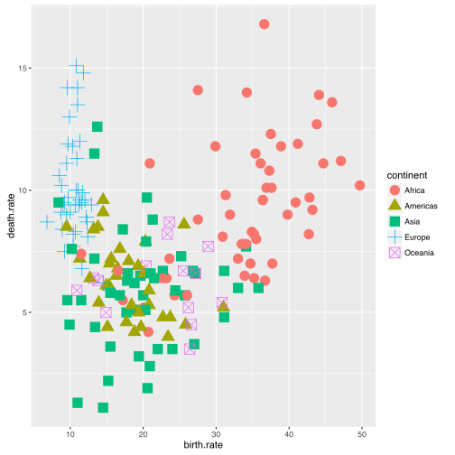

```r
pl + scale_color_brewer(type="qual", palette = 3)
```


```r
pl + scale_color_manual(values = c("red4", "red1", "green4", "green1", "grey"))
```

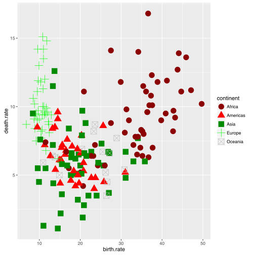

```r
pl + scale_shape_cleveland()
```

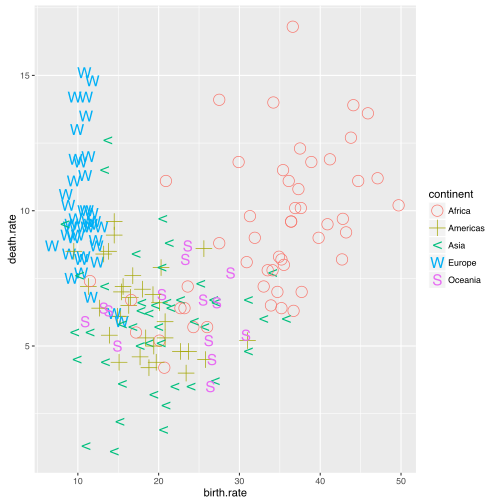

```r
pl + scale_shape_manual(values=LETTERS) 
```

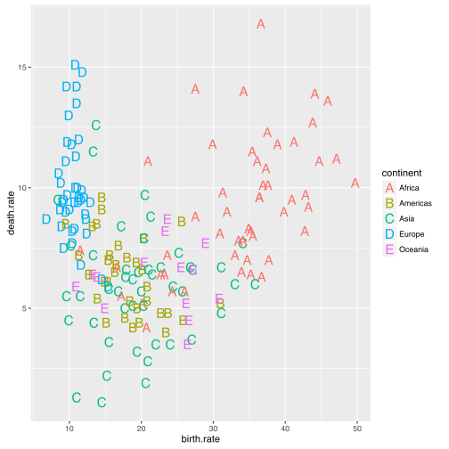

## Jak modyfikować układ współrzędnych?

Na wykresach dane są prezentowane w układzie współrzędnych. 
Układ jest ramą dla całego wykresu, domyślnie jest to rama kartezjańska.

Są jednak sytuacje, w których możemy chcieć tę ramę zmienić. Jeżeli przedstawiamy mapy to możemy chcieć wykorzystać inną projekcję. Możemy chcieć zamienić osie miejscami. Lub spowodować, że jedna z osi jest logarytmiczna lub pierwiastkowa. 
Jeżeli na osiach prezentowana jest ta sama jednostka to możemy zażyczyć sobie by zachowane były proporcje pomiędzy osią pionową a poziomą.

Wszystkie te rzeczy są możliwe przy odpowiednim określeniu układu współrzędnych.

Dla pakietu `ggplot` układ współrzędnych można określić funkcją `coord_`. Dla jednego wykresu określić można tyko jeden układ współrzędnych.


```r
pl <- ggplot(na.omit(countries), aes(x = birth.rate, y = death.rate)) +
  geom_point(size=2, color="black") 

pl + coord_fixed()
```

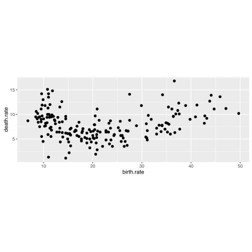

```r
pl + coord_flip()
```

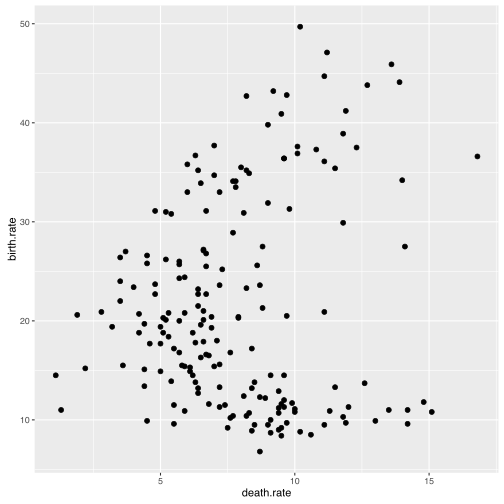

## Jak modyfikować styl wykresu?

Poza elementami związanymi z danymi, wykres zawiera również wiele elementów graficznych, które z danymi nie są zwiazane ale są ważne. Np. tytuł wykresu, wielkość opisów osi, położenie legendy, kolor linii pomocnicznych itp.

W pakiecie `ggplot2` można takie elementy dookreślać na dwa sposoby. Można skorzystać z gotowego zestawu ustawień graficznych, swoistej skórki. Takie skórki są dostępne przez funkcje `theme_`. 

Na poniższym przykładzie, dodanie do wykresu funkcji `theme_excel()` powoduje, że wykres wygląda jak z pakietu Excel.

Druga możliwość to zmiana poszczególnych elementów przez funkcję `theme()`. W ten sposób można przesunąć legendę, zmienić kolory osi, zwiększyć opisy osi i zmodyfikować podobne elementy wykresu.

Poniżej przedstawiamy ten sam wykres z zastosowaniem czterech różnych zestawów parametrów graficznych.


```r
pl <- ggplot(na.omit(countries), aes(x = birth.rate, y = death.rate)) +
  geom_point(size=2, color="black") 

pl
```

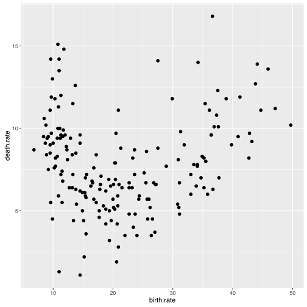

```r
pl + theme_excel()
```

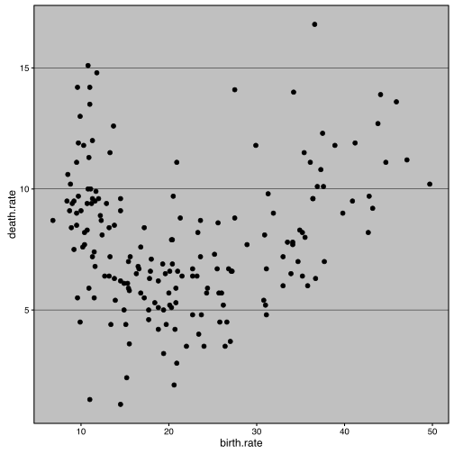

```r
pl + theme_bw() +  theme(legend.position="none") +
  theme(text=element_text(size=20)) + ggtitle("theme_bw")
```

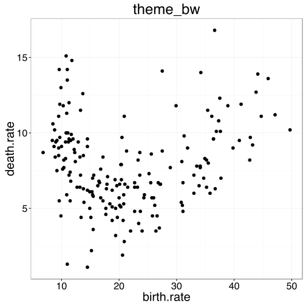

```r
pl + theme_classic() +  theme(legend.position="none") +
  theme(text=element_text(size=20)) + ggtitle("theme_classic")
```

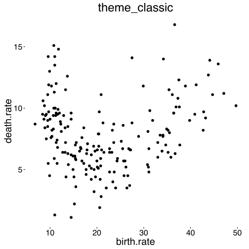

