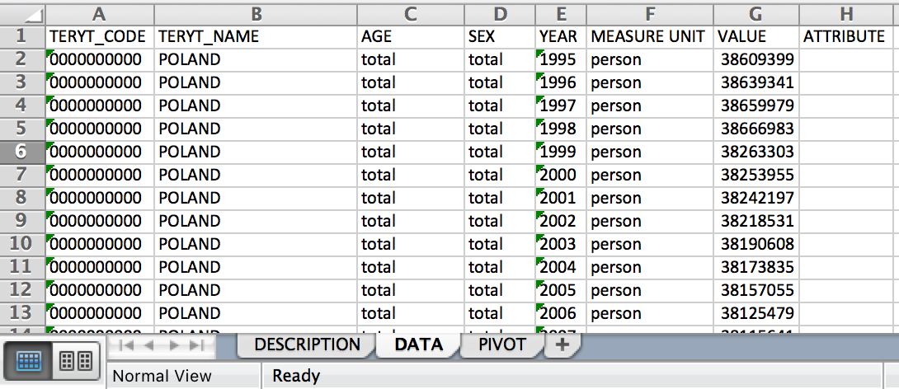

# Jak wczytać dane z Excela?

Jedną z najbardziej popularnych form przechowywania danych tabelarycznych są pliki Excela. Poniżej pokażemy jak takie dane odczytać z pliku Excela bezpośrednio do programu R.

Jako przykład wykorzystamy dane udostępniane przez Główny Urząd Statystyczny (GUS) w Banku Danych Lokalnych (BDL) https://bdl.stat.gov.pl/BDL/dane/wymiary. Przez interfejs www można wyklinać jakie wskaźniki w jakich grupach chcemy pobrać, a następnie możemy pobrać je w formacie pliku Excela.

Za pomocą strony www wybrałem dane dotyczące ludności Polsce w latach 1995:2015 w podziale na grupy wiekowe i płeć. Te dane są dostępne na stronie https://github.com/pbiecek/Przewodnik/blob/master/resources/LUDN_2137_20160225144358.xlsx.

Pliki Excela pobrane z BDL mają trzy zakładki. W pierwszej opisane są główne informacje dotyczące danych. Druga zakładka to dane w ta zwanej wąskiej/długiej postaci. Trzecia zakładka to dane w postaci szerokiej, gdzie kolejne kolumny odpowiadają kolejnym latom.

Poniżej umieszczone są zrzuty ekranu dla obu zakładek.




W programie R dostępnych jest kilka rożnych pakietów pozwalających na wczytywanie danych z Excela. Na dziś dzień, dla plików w formacie `xlsx` najbardziej uniwersalnym rozwiązaniem jest pakiet `openxlsx`. 

Funkcja `read.xlsx` pozwala na wczytanie danych z określonego pliku. Możemy dodatkowo określić z której zakładki chcemy wczytać dane. Zacznijmy od wczytania danych w postaci wąskiej z zakładki drugiej.


```r
library(openxlsx)
ludnosc <- read.xlsx("../resources/LUDN_2137_20160225144358.xlsx", sheet = 2)
```

```
## Error in read.xlsx.default("../resources/LUDN_2137_20160225144358.xlsx", : Excel file does not exist.
```

```r
head(ludnosc)
```

```
## Error in head(ludnosc): object 'ludnosc' not found
```

W podobny sposób możemy odczytać dane z zakładki 3.


```r
ludnoscSzeroka <- read.xlsx("../resources/LUDN_2137_20160225144358.xlsx", sheet = 3)
```

```
## Error in read.xlsx.default("../resources/LUDN_2137_20160225144358.xlsx", : Excel file does not exist.
```

```r
ludnoscSzeroka[3:8,1:10]
```

```
## Error in eval(expr, envir, enclos): object 'ludnoscSzeroka' not found
```


## Inne pakiety do wczytywania danych z Excela

W programie R dostępnych jest więcej pakietów pozwalających na wczytywanie danych z plików Excela. Zestawienie najpopularniejszych prezentuje poniższa tabela.

pakiet | funkcja_odczyt | funkcja_zapis  | formaty | funkcjonalność | szybkość | wymaga_programu
---           | ---    | ---    | --- | --- | --- | ---
readxl      | read_excel() | --- | .xlsx, .xls | średnia  | duża | 
openxlsx      | read.xlsx() | write.xlsx() | .xlsx | średnia  |duża | 
xlsx      | read.xlsx() | write.xlsx() | .xlsx, .xls | średnia  |mała | Java
XLConnect     | readWorksheet() | writeWorksheet() | .xlsx, .xls | duża  | mała | Java
gdata         | read.xls() | -- | .xlsx, .xls | mała | średnia | Perl
WriteXLS      | -- | WriteXLS() | .xlsx, .xls | mała | średnia | Perl


Może się zdarzyć, że z uwagi na dostępność zewnętrznych biblitek, na któryś systemie operacyjnym pewne pakiety nie będą działały, lub nie będą w stanie poprawnie wczytać określonych typów danych. W takim przypadku najlepiej spróbować innego pakietu z ww tabeli.

