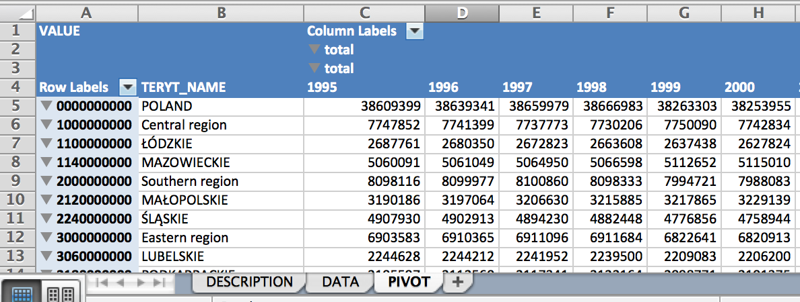

# Jak wczytać dane z Excela?

Jedną z najbardziej popularnych form przechowywania danych tabelarycznych są pliki Excela. Poniżej pokażemy jak takie dane odczytać z pliku Excela bezpośrednio do programu R.

Jako przykład wykorzystamy dane udostępniane przez Główny Urząd Statystyczny (GUS) w Danku Danych Lokalnych (BDL) https://bdl.stat.gov.pl/BDL/dane/wymiary. Przez interface www można wyklinać jakie wskaźniki w jakich grupach chcemy pobrać, a następnie możemy pobrać je w formacie pliku Excela.

Za pomocą strony www wybrałem dane dotyczące ludności Polsce w latach 1995:2015 w podziale na grupy wiekowe i płeć. Te dane są dostępne na stronie https://github.com/pbiecek/Przewodnik/blob/master/resources/LUDN_2137_20160225144358.xlsx.

Pliki Excela pobrane z BDL mają trzy zakładki. W pierwszej opisane są główne informacje dotyczące danych. Druga zakładka to dane w ta zwanej wąskiej/długiej postaci. Trzecia zakładka to dane w postaci szerokiej, gdzie kolejne kolumny odpowiadają kolejnym latom.

Poniżej umieszczone są zrzuty ekranu dla obu zakładek.




W programie R dostępnych jest kilka rożnych pakietów pozwalających na wczytywanie danych z Excela. Na dziś dzień, dla plików w formacie `xlsx` najbardziej uniwersalnym rozwiązaniem jest pakiet `openxlsx`. 

Funkcja `read.xlsx` pozwala na wczytanie danych z określonego pliku. Możemy dodatkowo określić z której zakładki chcemy wczytać dane. Zacznijmy od wczytania danych w postaci wąskiej z zakładki drugiej.


```r
library(openxlsx)
ludnosc <- read.xlsx("../resources/LUDN_2137_20160225144358.xlsx", sheet = 2)
head(ludnosc)
```

```
##   TERYT_CODE TERYT_NAME   AGE   SEX YEAR MEASURE.UNIT    VALUE ATTRIBUTE
## 1 0000000000     POLAND total total 1995       person 38609399          
## 2 0000000000     POLAND total total 1996       person 38639341          
## 3 0000000000     POLAND total total 1997       person 38659979          
## 4 0000000000     POLAND total total 1998       person 38666983          
## 5 0000000000     POLAND total total 1999       person 38263303          
## 6 0000000000     POLAND total total 2000       person 38253955
```

W podobny sposób możemy odczytać dane z zakładki 3.


```r
ludnoscSzeroka <- read.xlsx("../resources/LUDN_2137_20160225144358.xlsx", sheet = 3)
ludnoscSzeroka[3:8,1:10]
```

```
##        VALUE              X2 Column.Labels       X4       X5       X6
## 3 Row Labels      TERYT_NAME          1995     1996     1997     1998
## 4 0000000000          POLAND      38609399 38639341 38659979 38666983
## 5 1000000000  Central region       7747852  7741399  7737773  7730206
## 6 1100000000         ŁÓDZKIE       2687761  2680350  2672823  2663608
## 7 1140000000     MAZOWIECKIE       5060091  5061049  5064950  5066598
## 8 2000000000 Southern region       8098116  8099977  8100860  8098333
##         X7       X8       X9      X10
## 3     1999     2000     2001     2002
## 4 38263303 38253955 38242197 38218531
## 5  7750090  7742834  7738999  7736003
## 6  2637438  2627824  2617318  2607380
## 7  5112652  5115010  5121681  5128623
## 8  7994721  7988083  7978084  7968750
```


## Inne pakiety do wczytywania danych z Excela

W programie R dostępnych jest więcej pakietów pozwalających na wczytywanie danych z plików Excela. Zestawienie najpopularniejszych prezentuje poniższa tabela.

pakiet | funkcja_odczyt | funkcja_zapis  | formaty | funkcjonalność | szybkość | wymaga_programu
---           | ---    | ---    | --- | --- | --- | ---
readxl      | read_excel() | --- | .xlsx, .xls | średnia  | duża | 
openxlsx      | read.xlsx() | write.xlsx() | .xlsx | średnia  |duża | 
xlsx      | read.xlsx() | write.xlsx() | .xlsx, .xls | średnia  |mała | Java
XLConnect     | readWorksheet() | writeWorksheet() | .xlsx, .xls | duża  | mała | Java
gdata         | read.xls() | -- | .xlsx, .xls | mała | średnia | Perl
WriteXLS      | -- | WriteXLS() | .xlsx, .xls | mała | średnia | Perl


Może się zdarzyć, że z uwagi na dostępność zewnętrznych biblitek, na któryś systemie operacyjnym pewne pakiety nie będą działały, lub nie będą w stanie poprawnie wczytać określonych typów danych. W takim przypadku najlepiej spróbować innego pakietu z ww tabeli.

