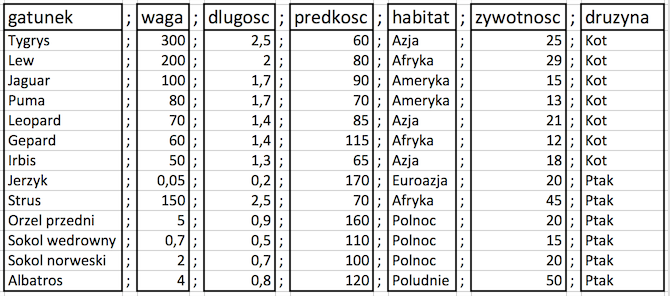
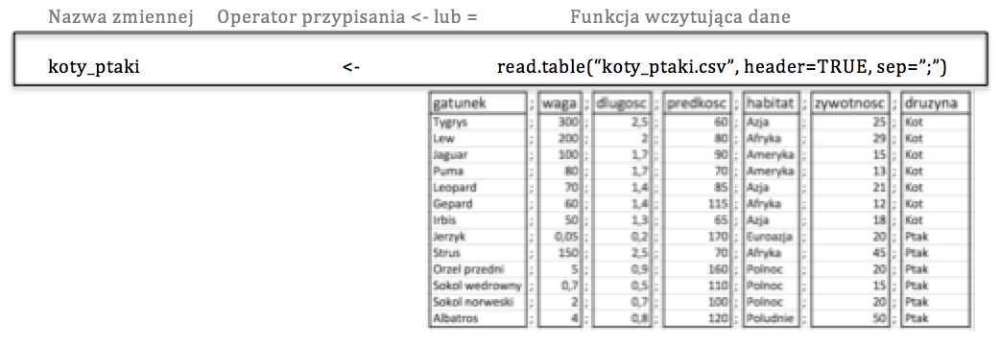
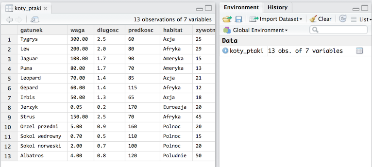

# Jak wczytać tabelę danych z pliku csv lub txt?

Jednym z bardziej uniwersalnych formatów przechowywania danych są pliki tekstowe, a więc takie, które możemy otworzyć w dowolnym edytorze, też w RStudio.

Pliki tekstowe zawierajace tabele z danymi mająz azwyczaj rozszerzenie `csv` (od ang. *comma separated values*, wartości rozdzielane przecinkami) lub `txt`.

Przyjrzymy się tabeli z danymi zapisanymi w pliku
http://biecek.pl/MOOC/dane/koty_ptaki.csv. Poniżej wklejam treść tego pliku.

```{}
gatunek;waga;dlugosc;predkosc;habitat;zywotnosc;druzyna
Tygrys;300;2,5;60;Azja;25;Kot
Lew;200;2;80;Afryka;29;Kot
Jaguar;100;1,7;90;Ameryka;15;Kot
Puma;80;1,7;70;Ameryka;13;Kot
Leopard;70;1,4;85;Azja;21;Kot
Gepard;60;1,4;115;Afryka;12;Kot
Irbis;50;1,3;65;Azja;18;Kot
Jerzyk;0,05;0,2;170;Euroazja;20;Ptak
Strus;150;2,5;70;Afryka;45;Ptak
Orzel przedni;5;0,9;160;Polnoc;20;Ptak
Sokol wedrowny;0,7;0,5;110;Polnoc;15;Ptak
Sokol norweski;2;0,7;100;Polnoc;20;Ptak
Albatros;4;0,8;120;Poludnie;50;Ptak
```

Jeżeli przyjrzymy się treści tego pliku, to zobaczymy, że zawiera on tabelę wartości, rozdzielanych średnikami. Pierwszy wiersz to nagłówek z nazwami kolumn (gatunek;waga;dlugosc;predkosc;habitat;zywotnosc;druzyna).



Aby dane w tym formacie wczytać do programu R, można wykorzystać funkcję `read.table()`.
Na poniższym przykładzie wczytana tabela liczb jest przypisywana za pomocą operatora `<-` do symbolu `koty_ptaki`.



Funkcja `read.table()` ma wiele argumentów (ich listę można spradzić w pliku pomocy pod hasłem `?read.table`), ale nie musimy ich wszystkich określać. Wystarczy wskazać nazwę pliku oraz te argumenty, które powinny mieć inne wartości niż domyślne. 

W przypadku rozważanego pliku musimy określić argumenty `file = "http://biecek.pl/MOOC/dane/koty_ptaki.csv"` (ścieżka do pliku tekstowego, w tym przypadku czytamy dane bezpośrednio z internetowego adresu), `sep=";"` (separatorem kolejnych pól będzie średnik), `dec=","` (separatorem dziesiętnym jest przecinek), `header=TRUE` (pierwszy wiersz ma nagłówek). Ponieważ wynik tej funkcji nie jest do niczego przypisany, dlatego wczytany zbiór danych jest wyświetlany na ekranie.


```r
koty_ptaki <- read.table(file = "http://biecek.pl/MOOC/dane/koty_ptaki.csv", 
          sep=";", dec=",", header=TRUE)
# Wypiszmy zawartość symbolu koty_ptaki
koty_ptaki
```

```
##           gatunek   waga dlugosc predkosc  habitat zywotnosc druzyna
## 1          Tygrys 300.00     2.5       60     Azja        25     Kot
## 2             Lew 200.00     2.0       80   Afryka        29     Kot
## 3          Jaguar 100.00     1.7       90  Ameryka        15     Kot
## 4            Puma  80.00     1.7       70  Ameryka        13     Kot
## 5         Leopard  70.00     1.4       85     Azja        21     Kot
## 6          Gepard  60.00     1.4      115   Afryka        12     Kot
## 7           Irbis  50.00     1.3       65     Azja        18     Kot
## 8          Jerzyk   0.05     0.2      170 Euroazja        20    Ptak
## 9           Strus 150.00     2.5       70   Afryka        45    Ptak
## 10  Orzel przedni   5.00     0.9      160   Polnoc        20    Ptak
## 11 Sokol wedrowny   0.70     0.5      110   Polnoc        15    Ptak
## 12 Sokol norweski   2.00     0.7      100   Polnoc        20    Ptak
## 13       Albatros   4.00     0.8      120 Poludnie        50    Ptak
```

W programie R Studio w prawym górnym oknie, zatytułowanym *Environment* wyświetlane są symbole widoczne w głównym środowisku.  Dwukrotne kliknięcie na wskazany symbol spowoduje otwarcie okna prezentującego zawartość zmiennej. W ten sposób możemy szybko podejrzeć co wczytało się do zmiennej `koty_ptaki`. Z przyczyn wydajnościowych wyświetlanych jest tylko pierwsze 1000 wierszy i kilkaset kolumn. Tak więc dla dużych zbiorów danych wyświetlony będzie tylko fragment całego zbioru.



## Inne narzędzia

Dla dużych plików wczytywanie funkcją `read.table()` może być czasochłonne, w takich sytuacjach warto rozważyć również funkcję  `fread {data.table}`.

