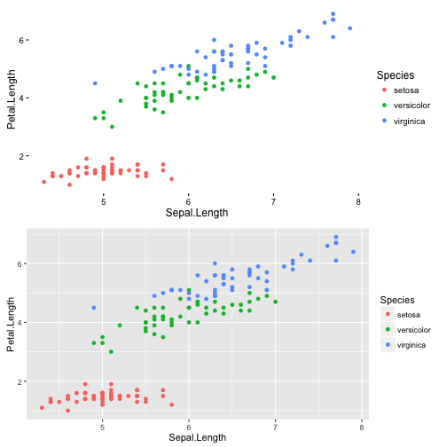
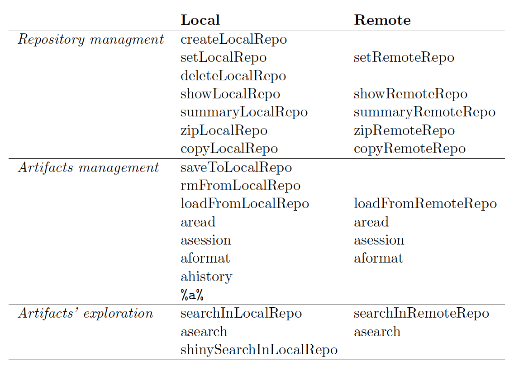

# Jak serializować obiekty z użyciem pakietu archivist?

W programie R wszystko jest obiektem. Każdy model, tabela, wykres, funkcja, wszystko jest obiektem, który żyje w pamięci aktualnie uruchomionej sesji R. 

Często jednak pojawia się potrzeba zapisania, odszukania lub przesłania obiektu z jednej sesji R do innej. Takie operacje są wspierane przez bibliotekę `archivist`.

Omówimy ją poniżej w oparciu o typowe przypadki użycia.

## Kluczowe pojęcia

Funkcja skrótu MD5 - kryptograficzna funkcja przypisująca każdemu dowolnemu ciągowi bajtów jednoznacznie wyznaczony hash, będący 32 znakami cyframi szesnastkowymi (256 bitów). Więcej informacji: https://pl.wikipedia.org/wiki/MD5

GitHub/Bitbucket - archiwa kodu w modelu cloud oparte o system Git/Mercurial

Repozytorium - zbiór obiektów wraz z API zapewniającym dodatkowo operacje wyszukiwania, odczytywania i zapisywania obiektów.

Repozytoria dzielimy na lokalne (umieszczone na dysku) i zdalne (w pakietach R lub na GitHub/Bitbucket).

Tag - etykieta opisująca zawartość obiektu, ułatwia odszukiwanie obiektów o określonych cechach.

## Odzyskiwanie obiektów

Obiekty, które są już w repozytorium można odczytać funkcją `aread()`.

Przykładowo poniższa linia odczyta z repozytorium `graphGallery` użytkownika `pbiecek` na Github obiekt o hashu `f05f0ed0662fe01850ec1b928830ef32`. Jest to wykres wykonany w pakiecie `ggplot2`.


```r
archivist::aread("pbiecek/graphGallery/f05f0ed0662fe01850ec1b928830ef32")
```


Aby odczytywać obiekty z lokalnego repozytorium, należy funkcją `setLocalRepo()` ustawić ścieżkę do repozytorium na dysku. 

Następnie wystarczy wywołać funkcję `aread()` podając jako argument jedynie hash obiektu. 
Poniżej odczytamy w ten sposób model liniowy.


```r
library(archivist)

(repoDir <- system.file("graphGallery", package = "archivist"))
```

```
## [1] "/Library/Frameworks/R.framework/Versions/3.3/Resources/library/archivist/graphGallery"
```

```r
setLocalRepo(repoDir)
aread("2a6e492cb6982f230e48cf46023e2e4f")
```

```
## 
## Call:
## lm(formula = Petal.Length ~ Sepal.Length + Species, data = iris)
## 
## Coefficients:
##       (Intercept)       Sepal.Length  Speciesversicolor  
##           -1.7023             0.6321             2.2101  
##  Speciesvirginica  
##            3.0900
```

## Wyszukiwanie obiektów

Obiekty są zapisywane do bazy danych razem z tagami, które umożliwiają łatwe wyszukiwanie tych obiektów.

Przykładowe tagi to data utworzenia, klasa, nazwy zmiennych, informacje o zależnościach pomiędzy obiektami czy nazwa symbolu do którego przypisany jest obiekt.

Przykładowo, poniższa instrukcja odczytuje z repozytorium wszystkie obiektu klasy `lm`, które wśród predyktorów mają zmienną `Sepal.Length`.


```r
models <- asearch("pbiecek/graphGallery",
                  patterns = c("class:lm", "coefname:Sepal.Length"))
lapply(models, coef)
```

```
## $`18a98048f0584469483afb65294ce3ed`
##  (Intercept) Sepal.Length 
##    -7.101443     1.858433 
## 
## $`2a6e492cb6982f230e48cf46023e2e4f`
##       (Intercept)      Sepal.Length Speciesversicolor  Speciesvirginica 
##        -1.7023422         0.6321099         2.2101378         3.0900021
```

W podobny sposób można z lokalnego repozytorium odczytać wszystkie wykresy klasy `gg`, które na osi OX mają zmienną `Sepal.Length`, 

Odczytajmy je i wyświetlmy na ekranie.


```r
plots <- asearch(patterns = c("class:gg", "labelx:Sepal.Length"))
length(plots)
```

```
## [1] 2
```

```r
library("gridExtra")
do.call(grid.arrange, plots)
```



## Historia obiektu

W odtwarzalnych obliczeniach kuszącą obietnicą jest możliwość odtworzenia historii obiektu, szczegółowych informacji jak obiekt był zbudowany.
Gdyby to było możliwe, dla każdego wyniku moglibyśmy sprawdzić jak został on osiągnięty.

Z pakietem `archivist` to często jest możliwe. Trzeba tylko używać operatora `%a%` przy tworzeniu obiektów. Ten operator zapisuje do repozytorium wszelkie informacje potrzebne do odtworzenia obiektu.


```r
library("archivist")
library("dplyr")
createLocalRepo("arepo", default = TRUE)
```

```
## Directory arepo did not exist. Forced to create a new directory.
```

```r
iris %a%
 filter(Sepal.Length < 6) %a%
 lm(Petal.Length~Species, data=.) %a%
 summary() -> tmp
```

```
## Tracing lm(Petal.Length ~ Species, data = `__LHS`) on exit
```

Funkcją `ahistory()` można odtworzyć historię danego obiektu. 


```r
ahistory(tmp)
```

```
##    env[[nm]]                             [ff575c261c949d073b2895b05d1097c3]
## -> filter(Sepal.Length < 6)              [d3696e13d15223c7d0bbccb33cc20a11]
## -> lm(Petal.Length ~ Species, data = .)  [990861c7c27812ee959f10e5f76fe2c3]
## -> summary()                             [050e41ec3bc40b3004bc6bdd356acae7]
```

```r
ahistory(md5hash = "050e41ec3bc40b3004bc6bdd356acae7")
```

```
##    env[[nm]]                             [ff575c261c949d073b2895b05d1097c3]
## -> filter(Sepal.Length < 6)              [d3696e13d15223c7d0bbccb33cc20a11]
## -> lm(Petal.Length ~ Species, data = .)  [990861c7c27812ee959f10e5f76fe2c3]
## -> summary()                             [050e41ec3bc40b3004bc6bdd356acae7]
```

Gdy obiekt jest zapisywany do repozytorium zapamiętywana jest też informacja o zainstalowanych pakietach. Można ją odtworzyć i odczytać. 


```r
sinfo <- asession("050e41ec3bc40b3004bc6bdd356acae7")
head(sinfo$packages)
```

```
##  package    * version date       source        
##  archivist  * 2.0.4   2016-05-13 CRAN (R 3.3.0)
##  assertthat   0.1     2013-12-06 CRAN (R 3.3.0)
##  BetaBit    * 1.2.1   2016-05-26 CRAN (R 3.3.0)
##  bitops       1.0-6   2013-08-17 CRAN (R 3.3.0)
##  chron        2.3-47  2015-06-24 CRAN (R 3.3.0)
##  colorspace   1.2-6   2015-03-11 CRAN (R 3.1.3)
```

## Tworzymy repozytorium i wypełniamy je obiektami

Aby zbudować lokalne repozytorium można wykorzystać funkcję `createLocalRepo()`.

Utwórzmy repozytorium `arepo` w lokalnym katalogu i uczyńmy je od razu domyślnym.


```r
repo <- "arepo"
createLocalRepo(repoDir = repo, default = TRUE)
```

Zbudujmy przykładowy wykres i dodajmy go do repozytorium używając funkcji `saveToLocalRepo()`. Repozytorium domyślne jest określone, nie ma więc konieczności podawania go w funkcji `saveToRepo()`.


```r
library("ggplot2")
pl <- qplot(Sepal.Length, Petal.Length, data = iris)
saveToLocalRepo(pl)
```

```
## [1] "abf399fa855697165294a45a6a2280f3"
## attr(,"data")
## [1] "ff575c261c949d073b2895b05d1097c3"
```

Hash obiektu jest produkowany funkcją `digest()`. Możemy zawsze sprawdzić czy się zgadza dla odczytanego obiektu.


```r
digest::digest(pl)
```

```
## [1] "abf399fa855697165294a45a6a2280f3"
```

Funkcjami `showLocalRepo()` i `summaryLocalRepo()` można wyświetlić statystyki dotyczące obiektów w repozytoriach.


```r
showLocalRepo(method = "tags")
```

```
##                            artifact
## 1  abf399fa855697165294a45a6a2280f3
## 2  abf399fa855697165294a45a6a2280f3
## 3  abf399fa855697165294a45a6a2280f3
## 4  abf399fa855697165294a45a6a2280f3
## 5  abf399fa855697165294a45a6a2280f3
## 6  abf399fa855697165294a45a6a2280f3
## 7  abf399fa855697165294a45a6a2280f3
## 8  a2bdc39c3b30379a9b009970ec06d606
## 9  abf399fa855697165294a45a6a2280f3
## 10 ff575c261c949d073b2895b05d1097c3
## 11 ff575c261c949d073b2895b05d1097c3
## 12 ff575c261c949d073b2895b05d1097c3
## 13 abf399fa855697165294a45a6a2280f3
##                                              tag         createdDate
## 1                                     format:rda 2016-05-29 23:57:47
## 2                                        name:pl 2016-05-29 23:57:47
## 3                                       class:gg 2016-05-29 23:57:47
## 4                                   class:ggplot 2016-05-29 23:57:47
## 5                            labelx:Sepal.Length 2016-05-29 23:57:47
## 6                            labely:Petal.Length 2016-05-29 23:57:47
## 7                       date:2016-05-29 23:57:47 2016-05-29 23:57:47
## 8                                     format:rda 2016-05-29 23:57:47
## 9  session_info:a2bdc39c3b30379a9b009970ec06d606 2016-05-29 23:57:47
## 10                                    format:rda 2016-05-29 23:57:47
## 11                                    format:txt 2016-05-29 23:57:47
## 12 relationWith:abf399fa855697165294a45a6a2280f3 2016-05-29 23:57:47
## 13                                    format:png 2016-05-29 23:57:47
```

```r
summaryLocalRepo()
```

```
## Number of archived artifacts in Repository:  1 
## Number of archived datasets in Repository:  1 
## Saves per day in Repository: 
##             Saves
## 2016-05-29     3
```

## Inne zastosowania

W połączeniu z funkcją `trace()` możemy dodać archiwizację wszystkich obiektów tworzonych przez określoną funkcje. Np. możemy do archiwum zapisać wszystkie modele liniowe zbudowane funkcją `lm()`.


```r
library("archivist")
createLocalRepo("allModels", default = TRUE)
```

```
## Directory allModels did not exist. Forced to create a new directory.
```

```r
trace(lm, exit = quote(saveToLocalRepo(z)))
```

```
## Tracing function "lm" in package "stats"
```

```
## [1] "lm"
```

Lub możemy połączyć pakiet `archivist` z pakietem `knitr` i wszystkie obiekty określonej klasy wyprodukowane przez `knitra` dodać do repozytorium.

Funkcja ` addHooksToPrint ()` automatycznie dodaje uchwyty w podpisach rysunków, jest to bardzo wygodne do odzyskiwania obiektów.

Przykład działania tego połączenia można obejrzeć pod adresem
http://bit.ly/1nW9Cvz

```
addHooksToPrint(class=c("ggplot", "data.frame"),
repoDir = "arepo", repo = "Eseje", user = "pbiecek", subdir = "arepo")
```

Dla repozytoriów można też przygotować listę wszystkich obiektów tam umieszczonych wraz z ich tagami. Przykład takiego katalogu znajduje się na stronie
https://github.com/pbiecek/Eseje/tree/master/arepo


